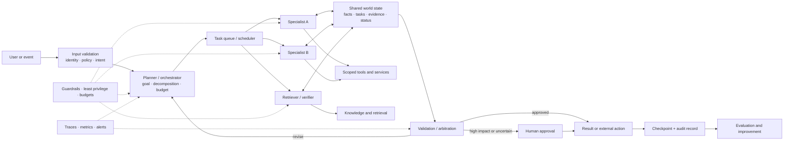
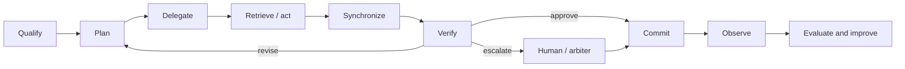
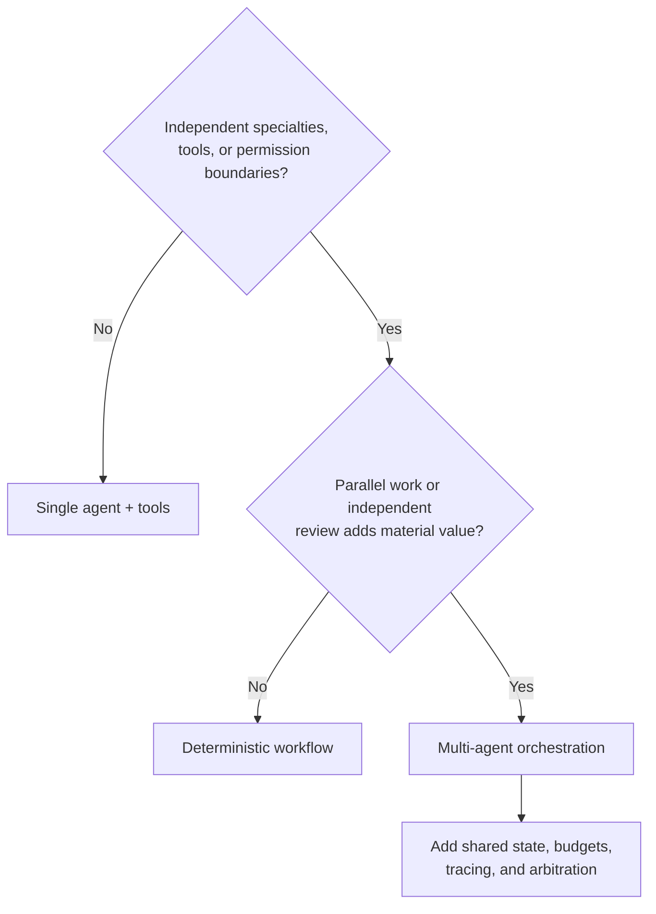
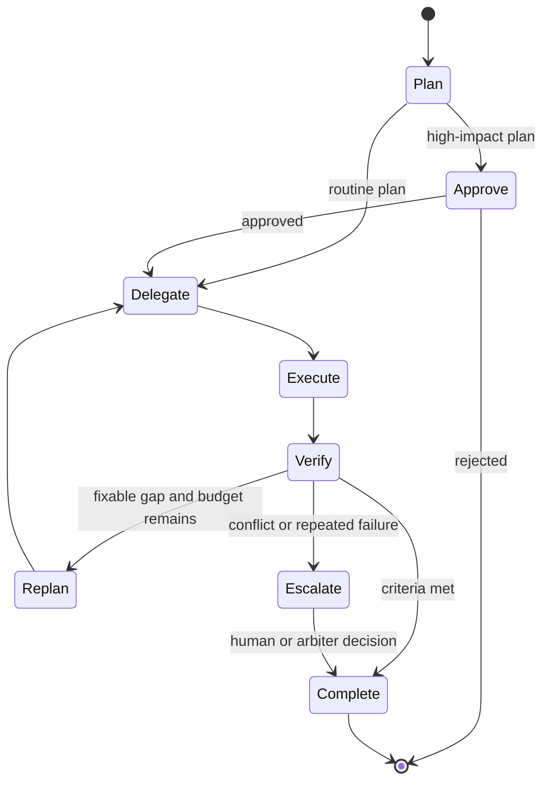
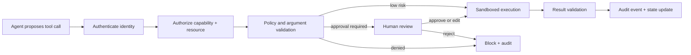
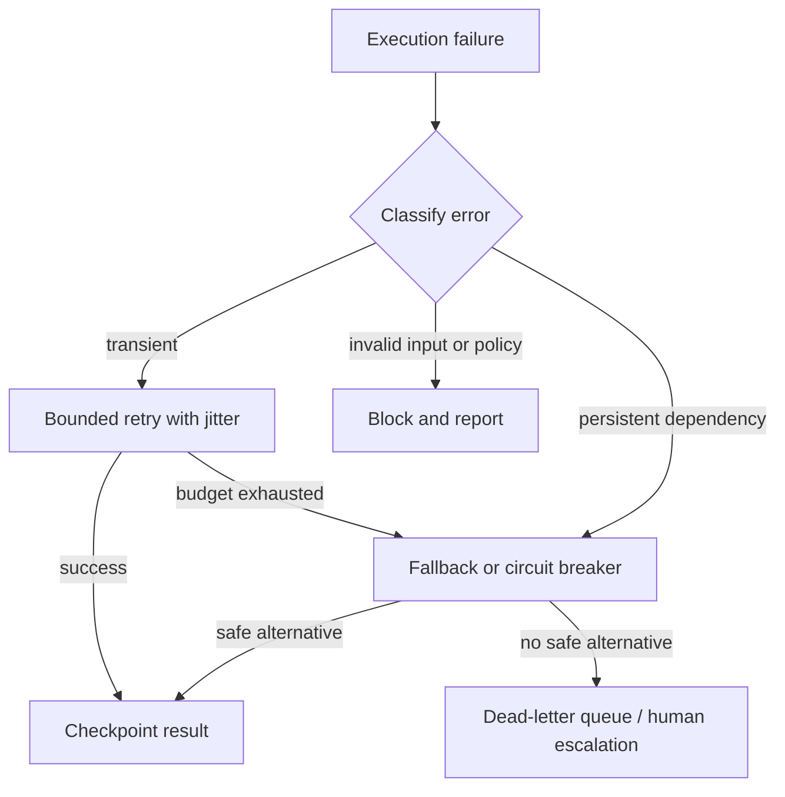
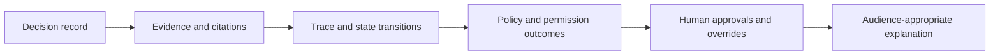

# Agentic Systems: From Coordination to Production

### An end-to-end guide to designing multi-agent systems that are useful, safe, observable, and resilient

**[Design pillars](#the-nine-design-pillars) · [Architecture](#end-to-end-reference-architecture) · [Lifecycle](#the-agentic-execution-lifecycle) · [Explainability](#explainability)**

---

## Purpose

An agentic system is more than a language model with tools. It is a governed execution environment in which autonomous or semi-autonomous components interpret goals, plan work, exchange context, call tools, validate results, and recover from failure.

This guide presents the architectural concerns that turn an agent demonstration into a dependable system. It focuses on the lifecycle from deciding whether multiple agents are warranted through coordination, memory, governance, evaluation, reliability, and cost control. Framework selection and a concrete CrewAI implementation are continued in [From Framework Choice to CrewAI Implementation](../crew-scribe/docs/crewai-framework-to-implementation.md).

## The nine design pillars

| # | Pillar | Core question |
| --- | --- | --- |
| 1 | **When to use multiple agents** | Does specialization or parallel work justify the added coordination cost? |
| 2 | **Agent-to-agent communication** | How do agents exchange typed messages, evidence, ownership, and control? |
| 3 | **Planning and coordination** | Who decomposes work, delegates it, verifies progress, and decides when to stop? |
| 4 | **Environment and memory** | Which state is shared, private, durable, retrievable, or disposable? |
| 5 | **Safety, permissions, and governance** | Which agent may perform which action, on what data, and under whose approval? |
| 6 | **Observability and evaluation** | Can the system reconstruct, measure, test, and improve every execution path? |
| 7 | **Scaling and reliability** | How does the system handle concurrency, recovery, load, and cost? |
| 8 | **Framework and build strategy** | Which orchestration abstraction fits the workflow and operating model? |
| 9 | **Anti-patterns and design review** | Which predictable failure modes must be removed before production? |

These concerns are connected. Planning depends on shared state; autonomy depends on permissions; guardrails depend on visibility; scaling depends on idempotency and recovery; and meaningful optimization depends on evaluation.

## End-to-end reference architecture

The orchestrator owns the workflow, specialists perform bounded work, shared state preserves a consistent world view, and policy and telemetry surround every step.

## The agentic execution lifecycle

1. **Qualify** the request, identity, risk, and policy context.
2. **Plan** the work with explicit success criteria, dependencies, and budgets.
3. **Delegate** bounded tasks to agents with the right capability and authority.
4. **Retrieve or act** through typed, scoped tools.
5. **Synchronize** authoritative facts, artifacts, and progress through shared state.
6. **Verify** outputs, resolve disagreement, and request approval where needed.
7. **Commit** external effects exactly once and checkpoint durable progress.
8. **Observe and evaluate** the complete path for quality and improvement.

## 1. When multiple agents are justified

Multiple agents are an architectural trade-off, not a default. They are valuable when work has separable specialties, independent tasks can run concurrently, different permission boundaries are necessary, or independent review materially reduces risk.

Prefer a single agent or deterministic workflow when:

- one model can complete the task within a bounded context;
- the steps are strictly sequential and share most of their information;
- latency, cost, and operational simplicity matter more than specialization; or
- the organization cannot yet trace and evaluate cross-agent behavior.

The correct baseline is the simplest design that meets the quality, control, and throughput requirements. A multi-agent approach should demonstrate measurable improvement over that baseline.

## 2. Agent-to-agent communication

Agent collaboration requires a protocol rather than an unstructured transcript. Each message or hand-off should identify:

- task, session, sender, receiver, and current owner;
- objective, constraints, priority, deadline, and remaining budget;
- typed payload and expected output schema;
- evidence and artifact references rather than unnecessary copied context;
- status such as requested, accepted, blocked, completed, rejected, or escalated; and
- retry, acknowledgement, and idempotency semantics.

Useful coordination patterns include:

- **Turn-taking:** round-robin for symmetric collaboration or leader-directed turns for hierarchical work.
- **Role hand-off:** the current owner transfers a bounded assignment and the receiver explicitly accepts it.
- **Publish/subscribe:** agents react to relevant state events without direct peer coupling.
- **Request/response:** an agent asks a specialist for a typed result within a deadline.
- **Arbitration:** a verifier, deterministic rule, judge, or human resolves conflicting proposals.

Voting increases diversity but does not guarantee truth. Require evidence, weight contributors by demonstrated competence, and escalate when agreement or confidence remains below a defined threshold.

## 3. Planning and coordination

A global planner protects the overall objective by decomposing work, recording dependencies, assigning owners, allocating budgets, and consolidating results. Local agents may decide how to perform their own assignments, but should not silently redefine global scope.

Strong planning establishes:

- a task graph with inputs, outputs, dependencies, and acceptance criteria;
- capability-aware routing and dynamic reassignment;
- plan verification before expensive or irreversible work;
- explicit token, time, step, tool-call, and monetary budgets;
- completion, cancellation, retry, fallback, and escalation conditions; and
- approval gates for sensitive decisions or external side effects.

Stop conditions are part of correctness. A workflow without bounded steps, time, cost, or success criteria can continue producing plausible activity without producing value.

## 4. Environment and memory architecture

Plans work only when agents operate on a consistent world state. Use several memory scopes rather than one unbounded conversation.

| Scope | Contains | Typical access | Retention |
| --- | --- | --- | --- |
| **Execution state** | task graph, owners, status, dependencies, budgets | orchestrator and authorized workers | workflow lifetime; checkpointed |
| **Shared context** | approved facts, evidence, decisions, artifact references | relevant agents | versioned; stale entries expire |
| **Local scratchpad** | temporary calculations and agent-specific notes | one agent | short-lived and non-authoritative |
| **Conversation memory** | user-visible interaction history | session participants | summarized or compacted |
| **Long-term knowledge** | documents, policies, reusable facts, preferences | governed retrieval layer | durable with retention policy |
| **Audit history** | actions, approvals, policy outcomes, committed effects | operators and auditors | immutable, policy-defined retention |

The operational rule is: **shared state contains authoritative coordination facts; local memory contains disposable working context**.

### Agentic retrieval

Retrieval should be a deliberate, observable capability:

1. form a query from the task and access context;
2. retrieve from approved sources using permission filters;
3. rerank or validate relevance and freshness;
4. attach source identity, version, and citation metadata;
5. cache safe reusable results and deduplicate repeated work; and
6. state uncertainty when evidence is insufficient.

### Consistency and durability

Use versioning or compare-and-swap for concurrent state updates, TTLs for ephemeral material, durable checkpoints after meaningful milestones, and idempotency keys for operations with external effects. Large artifacts should live in object storage with references in state, rather than being repeatedly copied into model context.

## 5. Safety, permissions, and governance

Agents should receive capabilities, not ambient authority. Give each role the minimum tools, data scope, network access, credentials, and execution environment required for its task.

Defense in depth includes:

- **Identity and least privilege:** separate service identities, scoped credentials, and tool allowlists.
- **External policy enforcement:** validate capability, resource, arguments, and risk outside the prompt.
- **Sandboxing and isolation:** restrict filesystem, network, execution time, memory, and packages.
- **Data controls:** classify inputs and outputs, redact secrets, and enforce retention and residency.
- **Content controls:** moderate user, tool, retrieval, and inter-agent messages where appropriate.
- **Human approval:** pause before irreversible, regulated, financial, or externally visible actions.
- **Auditability:** record requests, decisions, approvals, attempts, denials, and committed effects.
- **Emergency control:** independently revoke credentials, stop workers, drain queues, and block new work.

Prompts can describe policy, but they are not an authorization boundary. Enforcement must remain deterministic and outside model control.

## 6. Observability and evaluation

Visibility must span the whole objective, not stop at individual model calls. Assign one trace ID to the request and model every planner, agent, model, retrieval, policy, approval, and tool operation as a causally connected span.

### Trace

Capture prompt and model versions, routes, state transitions, tool calls, evidence references, latency, tokens, cost, retries, policy outcomes, approvals, errors, and final status. Redact secrets and sensitive content while preserving useful metadata.

### Measure

Track at least:

| Dimension | Useful metrics |
| --- | --- |
| Outcome | task success, acceptance rate, groundedness, policy compliance |
| Efficiency | steps per task, duplicate work, cache hit rate, tokens, cost per successful task |
| Performance | end-to-end and per-stage latency, queue time, throughput |
| Reliability | retry rate, tool errors, fallback rate, stuck loops, recovery time |
| Human oversight | intervention, approval, edit, rejection, and escalation rates |

### Evaluate

Maintain scenario suites that cover normal, edge, adversarial, ambiguous, conflicting-data, permission-sensitive, and failure-recovery cases. Use deterministic assertions where possible and calibrated model or human evaluation where semantic judgment is necessary.

Golden tests should verify behavior rather than only exact wording: required fields, citation validity, correct tool selection, absence of forbidden actions, schema adherence, and task-specific quality thresholds. Run the suite in CI whenever prompts, models, policies, tools, routing, or state schemas change.

## 7. Scaling and reliability

Agentic systems inherit the problems of distributed systems. Parallelism improves throughput only when queues, shared resources, provider limits, and failure semantics are explicit.

| Concern | Production pattern |
| --- | --- |
| Concurrency | queues, bounded worker pools, rate limits, locks, optimistic concurrency, backpressure |
| Isolation | separate processes or containers, sandboxed tools, per-agent credentials, resource quotas |
| Transient failure | timeouts, bounded exponential backoff with jitter, circuit breakers |
| Persistent failure | fallback agent/model/tool, dead-letter queue, human escalation |
| Recovery | durable checkpoints, resume from last committed step, replay-safe tasks |
| Side effects | idempotency keys, exactly-once business semantics, compensating actions |
| Degradation | return verified partial results with explicit limitations |
| Cost | model routing, caching, batching, context compaction, cumulative budget enforcement |

### Failure path

Retry computation freely only when external effects are idempotent or compensatable. Checkpoint before and after consequential operations, record the commit status, and use a stable business idempotency key so replay cannot duplicate an email, ticket, payment, or database update.

### Cost control

Route straightforward tasks to smaller models and reserve expensive models for ambiguity, synthesis, or high-stakes review. Cache retrieval and deterministic results, batch compatible requests, compact stale context, enforce per-task and cumulative budgets, and measure cost per successful outcome rather than cost per model call.

## Anti-patterns and production checklist

### Avoid these patterns

- **Multi-agent by default:** more agents add latency, cost, nondeterminism, and debugging surface.
- **Several global planners:** conflicting decomposition produces duplicate or contradictory work.
- **Conversation as the database:** chat history is not typed, concurrent, durable, or authoritative state.
- **Shared mutable state without ownership:** parallel writers overwrite facts and create stale decisions.
- **Unlimited autonomy:** missing budgets and stop conditions turn uncertainty into loops.
- **Prompt-only security:** instructions cannot replace authentication, authorization, policy, or sandboxing.
- **Blind retry:** replaying non-idempotent actions duplicates side effects.
- **Self-judging agents:** use deterministic checks, independent verification, evidence, or human review.
- **Logs without causality:** isolated transcripts cannot explain cross-agent outcomes.
- **Fluency as the success metric:** plausible text is not task completion, factuality, safety, or value.

### Readiness checklist

- [ ] Multi-agent complexity is justified against a simpler baseline.
- [ ] Every agent has a bounded role, owner, schema, tool allowlist, and resource budget.
- [ ] Global, shared, local, durable, and audit state are explicitly separated.
- [ ] Hand-offs carry identity, evidence, ownership, status, budget, and completion contracts.
- [ ] Success, stop, retry, fallback, cancellation, and escalation paths are defined.
- [ ] Side effects use approval gates, idempotency keys, and compensation where needed.
- [ ] Secrets and permissions are scoped per agent and environment.
- [ ] One trace connects the objective, agents, tools, state changes, and result.
- [ ] Evaluations cover normal, edge, adversarial, and policy-sensitive scenarios.
- [ ] Quality, cost, latency, loops, retries, interventions, and recovery are monitored.
- [ ] Operators can inspect, pause, resume, revoke, and stop the system.

## Explainability

Explainability is a cross-cutting operational requirement. A useful explanation is not hidden chain-of-thought. It is an evidence-backed reconstruction of **what happened, why the system chose that path, what information it used, which controls applied, and who authorized consequential actions**.

For each meaningful decision, retain:

- objective, actor, timestamp, versions, and trace/span identifiers;
- route or delegation selected and a concise structured reason code;
- alternatives considered at an appropriate level and recorded uncertainty;
- evidence identifiers, citations, retrieval versions, and freshness;
- tool inputs and summarized results with sensitive fields redacted;
- policy outcomes, permission grants or denials, budget state, and stop conditions;
- verifier results, human approvals, edits, overrides, and accountable owner; and
- final outcome, side effects committed, limitations, and evaluation scores.

Different audiences need different views. Users need sources, confidence, and limitations. Operators need traces and state transitions. Auditors need immutable decisions and approvals. Developers need reproducible inputs, versions, and evaluation failures. This makes explainability a system capability, not a story generated after the event.

## Continue to implementation

The next guide compares visual automation, graph-based orchestration, and role-based agent frameworks, then translates these principles into a concrete CrewAI content workflow:

**[From Framework Choice to CrewAI Implementation](../crew-scribe/docs/crewai-framework-to-implementation.md)**

---

**A production agent is a governed, stateful, observable workflow with explicit authority, evidence, budgets, and recovery.**

