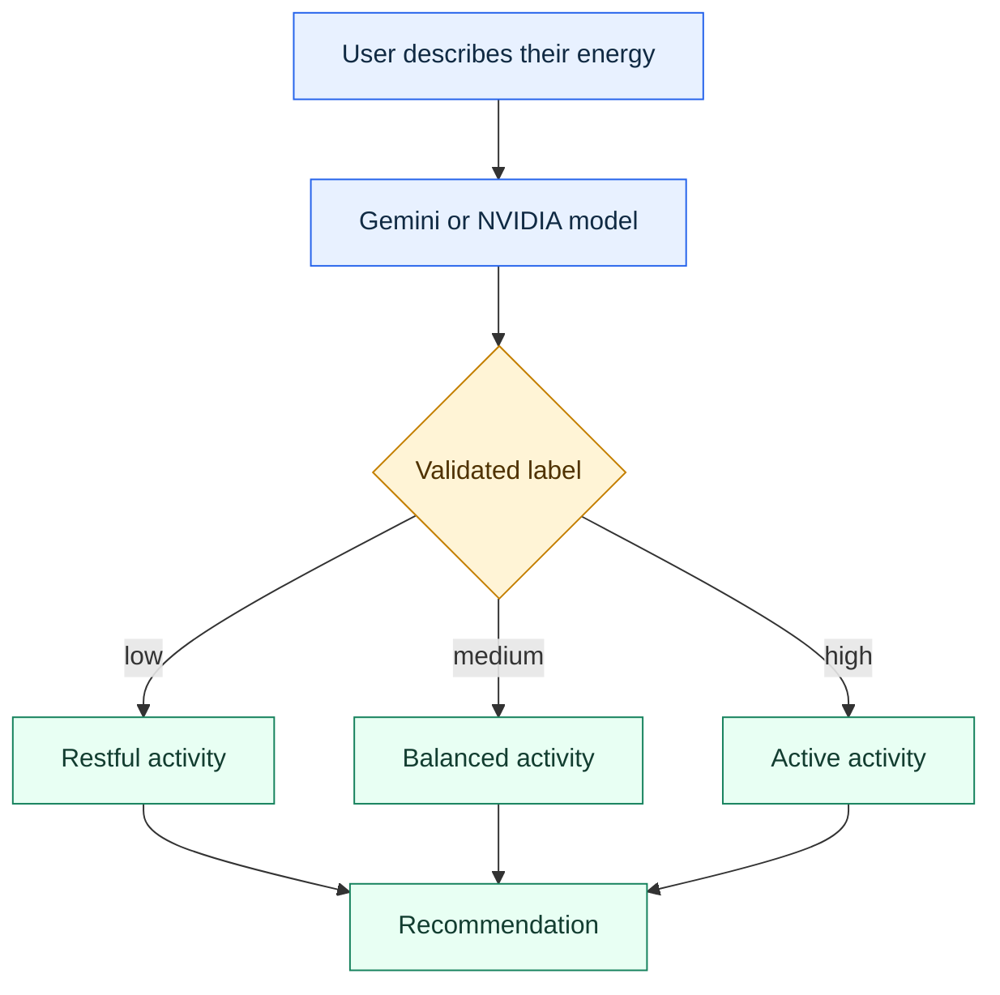
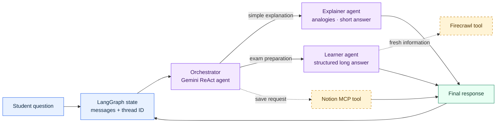

<div align="center">

# 🧭 Agentic Workflow Patterns

### Learn how agent systems classify, route, delegate, use tools, and preserve context

[](https://www.python.org/)
[](https://langchain-ai.github.io/langgraph/)
[](https://ai.google.dev/)
[](https://docs.astral.sh/uv/)

**[Purpose](#-purpose) · [Architecture](#-architecture) · [Examples](#-examples) · [Setup](#-setup-from-a-fresh-clone)**

</div>

---

## 🎯 Purpose

This repository turns core agentic-AI ideas into two small systems that can be read, run, changed, and tested locally. It was created for the Hasgeek community at The Fifth Elephant to make multi-agent design concrete: begin with deterministic graph structure, introduce model-based decisions, delegate to specialists, and add external tools only where they improve the outcome.

Its essence is **progressive complexity**:

1. Start with one model decision and three explicit branches.
2. Move to an orchestrator that delegates to specialist agents.
3. Preserve multi-turn context with a LangGraph checkpointer.
4. Add web search and Notion persistence as optional capabilities.

The examples are deliberately compact enough to understand in one sitting, while still demonstrating patterns used in larger systems: typed state, conditional edges, supervisor-style routing, tool calling, ReAct loops, memory, provider configuration, and MCP integration.

> [!NOTE]
> The local directory is named `agentic-workflow-patterns` because the code is useful beyond a specific event or city. The Git remote retains its original name, so existing upstream history and links continue to work.

## 💡 What, why, and how

| Question | Answer |
| --- | --- |
| **What is here?** | A conditional activity recommender and a multi-agent learning assistant, both implemented as LangGraph workflows. |
| **Why these examples?** | Together they show the progression from explicit graph routing to model-directed delegation with optional external tools. |
| **How do they work?** | Python functions become graph nodes or tools; shared state moves through the graph; Gemini chooses a route or tool; LangGraph controls execution and memory. |
| **Who is it for?** | Developers learning agent orchestration, educators demonstrating agent patterns, and teams prototyping a graph before building a production service. |
| **What is it not?** | A production learning platform, autonomous general-purpose agent, or replacement for authorization, observability, and durable storage infrastructure. |

## 🏗️ Architecture

### Repository-level learning path

```mermaid
flowchart LR
    A["1 · User input"] --> B["2 · Model decision"]
    B --> C["Conditional routing<br/>explicit graph branches"]
    C --> D["Multi-agent delegation<br/>specialists exposed as tools"]
    D --> E["Optional capabilities<br/>Firecrawl · Notion MCP"]
    E --> F["Response + retained<br/>conversation context"]

    classDef start fill:#E8F1FF,stroke:#2563EB,color:#102A43;
    classDef core fill:#F3E8FF,stroke:#7C3AED,color:#3B1764;
    classDef tools fill:#E8FFF3,stroke:#16825D,color:#123D30;
    classDef result fill:#FFF4D6,stroke:#C47F00,color:#4F3200;
    class A,B start;
    class C,D core;
    class E tools;
    class F result;
```



### Pattern 1: conditional routing

The first example asks a model to classify a user's energy as `low`, `medium`, or `high`. LangGraph then follows an explicit edge to a deterministic recommendation node.



The model performs only the fuzzy classification. The application owns the allowed labels, branch map, and final actions. This is a useful boundary when AI judgment is helpful but execution should remain predictable.

### Pattern 2: orchestrator and specialists

The second example uses a supervisor-style agent. The orchestrator interprets intent and calls a specialist as a LangChain tool. LangGraph provides the state container and in-memory conversation checkpoint.



Dashed nodes are optional. If their environment variables are absent, they are not exposed to the agent, keeping the core learning flow usable with only a Google API key.

## 🧪 Examples

| Project | Core lesson | Model/tool surface | Run |
| --- | --- | --- | --- |
| [`conditional-routing/`](conditional-routing/README.md) | Use model classification to select a constrained graph branch | Gemini by default; optional NVIDIA model | `make run-router` |
| [`multi-agent-workflow/`](multi-agent-workflow/README.md) | Delegate by intent to specialist agents while preserving conversation context | Gemini, optional Firecrawl, optional Notion MCP | `make run-learning` |

### When to use each pattern

Use **conditional routing** when the possible paths are known and you want code to control every downstream action. Examples include request triage, severity classification, document processing, and support routing.

Use an **orchestrator with specialist tools** when the user's intent is open-ended and the system must choose among capabilities. This fits research assistants, learning systems, development agents, and operational copilots.

## 🧰 Libraries and responsibilities

| Library | Used for | Why it is here |
| --- | --- | --- |
| [LangGraph](https://langchain-ai.github.io/langgraph/) | State graphs, conditional edges, ReAct agents, and checkpointing | Makes execution paths and state transitions explicit |
| [LangChain](https://python.langchain.com/) | Messages, structured tools, and model abstractions | Adapts specialist agents and integrations to a common tool interface |
| [langchain-google-genai](https://python.langchain.com/docs/integrations/chat/google_generative_ai/) | Gemini chat model integration | Powers classification, orchestration, and specialist responses |
| `langchain-nvidia-ai-endpoints` | Optional NVIDIA-hosted model integration | Demonstrates provider selection in the routing example |
| [Pydantic](https://docs.pydantic.dev/) | Tool input schemas | Gives agent tools explicit, validated arguments |
| [Firecrawl](https://docs.firecrawl.dev/) | Optional web search and page extraction | Adds current external material to detailed learning responses |
| [Model Context Protocol](https://modelcontextprotocol.io/) | Optional Notion tool connection | Demonstrates a standard agent-to-tool boundary |
| [structlog](https://www.structlog.org/) | Structured application events | Makes agent selection and failures easier to observe |
| [python-dotenv](https://saurabh-kumar.com/python-dotenv/) | Local environment loading | Keeps credentials out of source code |
| [uv](https://docs.astral.sh/uv/) | Python and dependency management | Provides repeatable, fast setup and execution |

## 🚀 Setup from a fresh clone

### 1. Prerequisites

- Git
- Python 3.12 or 3.13
- [uv](https://docs.astral.sh/uv/getting-started/installation/)
- A [Google AI Studio API key](https://aistudio.google.com/app/apikey)
- Node.js only if you enable the optional Notion MCP server

Verify the tools:

```bash
git --version
python --version
uv --version
```

### 2. Clone into the new local directory name

```bash
git clone https://github.com/Mahita07/hasgeek-agentic-workshop-blr.git agentic-workflow-patterns
cd agentic-workflow-patterns
```

### 3. Install both examples

```bash
make setup
```

Without Make:

```bash
uv sync --project conditional-routing
uv sync --project multi-agent-workflow
```

Each subproject gets its own isolated `.venv`; activating it is optional when you use `uv run` or the root Make targets.

### 4. Configure the example you want to run

```bash
cp conditional-routing/.env.example conditional-routing/.env
cp multi-agent-workflow/.env.example multi-agent-workflow/.env
```

Open the relevant `.env` and replace only the placeholder values you need. At minimum:

```dotenv
GOOGLE_API_KEY=your_google_ai_studio_key
```

> [!CAUTION]
> Never commit `.env` files or real credentials. The supplied `.gitignore` files exclude local environment files, and `.env.example` contains placeholders only.

### 5. Verify before calling a model

```bash
make test
make check
```

The deterministic router tests mock the model, so they run without network access or an API key.

### 6. Run an application

```bash
make run-router
```

Or:

```bash
make run-learning
```

The learning assistant also accepts a one-shot query:

```bash
cd multi-agent-workflow
uv run python main.py "Explain database normalization for an exam"
```

## 🔐 Configuration matrix

| Variable | Required by | Required? | Purpose |
| --- | --- | --- | --- |
| `GOOGLE_API_KEY` | Both examples with Gemini | Yes | Authenticates Gemini requests |
| `LLM_PROVIDER` | Conditional router | No | `gemini` by default; set `nvidia` for NVIDIA endpoints |
| `GEMINI_MODEL` | Conditional router | No | Overrides the default Gemini model |
| `NVIDIA_API_KEY` | Conditional router | Only for NVIDIA | Authenticates NVIDIA model requests |
| `NVIDIA_MODEL` | Conditional router | Only for NVIDIA | Selects the hosted NVIDIA model |
| `FIRECRAWL_API_KEY` | Learning assistant | No | Enables web enrichment for the learner agent |
| `MCP_SERVER_URL` | Learning assistant | No | URL of the local Notion MCP endpoint |
| `MCP_AUTH_TOKEN` | Learning assistant | No | Bearer token shared with that local MCP server |
| `PARENT_PAGE_ID` | Learning assistant | No | Notion page below which notes are created |

To use NVIDIA in the router:

```bash
make setup-nvidia
```

Then set `LLM_PROVIDER=nvidia`, `NVIDIA_API_KEY`, and `NVIDIA_MODEL` in `conditional-routing/.env`.

## 🔌 Optional integrations

### Firecrawl

Add `FIRECRAWL_API_KEY` to `multi-agent-workflow/.env`. The learner receives the Firecrawl tool only when the key exists. It may then retrieve current sources when a question benefits from external material.

### Notion through MCP

1. Create a Notion integration and connect it to a parent page.
2. Fill in the three Notion MCP variables in `multi-agent-workflow/.env`.
3. Start the Notion MCP server in a separate terminal:

```bash
NOTION_TOKEN="your_notion_token" npx @notionhq/notion-mcp-server \
  --transport http \
  --port 3000 \
  --auth-token "the_same_value_as_MCP_AUTH_TOKEN"
```

4. Start the learning assistant and ask it to save generated notes.

Only trusted MCP servers should receive credentials or generated content. Review tool permissions before connecting a real workspace.

## 📁 Repository map

```text
agentic-workflow-patterns/
├── README.md
├── Makefile                         # Common setup, test, check, and run targets
├── conditional-routing/
│   ├── app.py                       # Typed graph, model factory, classifier, CLI
│   ├── tests/test_app.py            # Credential-free routing tests
│   ├── pyproject.toml               # Core and optional NVIDIA dependencies
│   ├── uv.lock                      # Reproducible dependency resolution
│   └── .env.example
└── multi-agent-workflow/
    ├── main.py                      # Interactive and one-shot CLI
    ├── multi_agentic_workflow.py    # State, checkpoint, and graph definition
    ├── agents/
    │   ├── orchestrator_agent.py    # Intent routing and tool selection
    │   ├── explainer_agent.py       # Concise, beginner-friendly teaching
    │   └── learner_agent.py         # Detailed exam-oriented teaching
    ├── tools/
    │   ├── firecrawl_tool.py        # Optional external research
    │   └── save_to_notion.py        # Optional persistence tool
    ├── notion_mcp/
    │   └── notion_mcp_client.py     # Streamable HTTP MCP client
    ├── pyproject.toml
    └── .env.example
```

## 🧠 Design principles

- **Graphs own control flow.** Model output selects from bounded routes; it does not create arbitrary execution paths.
- **Specialists own domain responses.** The orchestrator routes and coordinates instead of trying to teach everything itself.
- **Tools are capabilities, not personalities.** Agents receive tools only when configuration makes them usable.
- **State is explicit.** Messages and workflow outputs move through typed state rather than hidden globals.
- **Optional services fail closed.** Missing Firecrawl or Notion settings remove those tools instead of breaking the core application.
- **Credentials stay outside code.** Local `.env` files are ignored, while templates contain placeholders.
- **Tests avoid model calls.** Routing behavior can be verified deterministically with a mocked classifier.

## 🛠️ Troubleshooting

| Symptom | Resolution |
| --- | --- |
| `uv: command not found` | Install uv, restart the terminal, and run `uv --version` |
| `GOOGLE_API_KEY` error | Copy the relevant `.env.example` to `.env` and replace the placeholder |
| Unsupported Python version | Run `uv python install 3.13` followed by `uv python pin 3.13` |
| NVIDIA import error | Run `make setup-nvidia` before selecting `LLM_PROVIDER=nvidia` |
| Firecrawl is never called | Add a valid `FIRECRAWL_API_KEY`; the tool is intentionally absent otherwise |
| Notion saving is unavailable | Configure all three MCP variables and start the local MCP server first |
| PowerShell blocks activation | Activation is unnecessary with `uv run`; otherwise adjust policy for the current process only |

## 🌱 Good next extensions

- Replace in-memory checkpoints with durable storage.
- Add structured intent classification and routing evaluations.
- Stream graph events to a web or terminal interface.
- Add retry, timeout, rate-limit, and circuit-breaker policies around external tools.
- Record token usage, latency, selected routes, and tool outcomes without logging sensitive prompts.
- Add human approval before writes to Notion or any other external system.
- Package the workflows behind an API with authentication and per-user conversation IDs.

---

<div align="center">

**Start with explicit control flow. Add autonomy only where it creates measurable value.**

</div>
