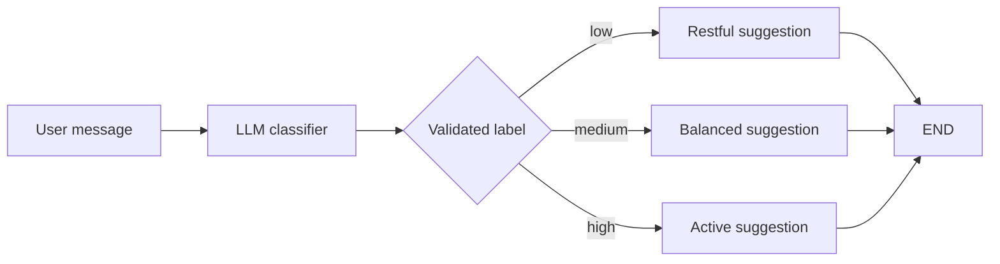

# Conditional Routing with LangGraph

A minimal graph that uses an LLM for one bounded decision: classify a user's energy as `low`, `medium`, or `high`. LangGraph then routes to a deterministic recommendation node.



This pattern is useful when natural-language interpretation is needed but the allowed actions and transitions must remain under application control.

## Files

| Path | Role |
| --- | --- |
| `app.py` | Model factory, typed graph state, nodes, routing, and CLI |
| `tests/test_app.py` | Model-free unit tests for classification and graph routing |
| `pyproject.toml` | Core dependencies and optional NVIDIA integration |
| `uv.lock` | Locked dependency graph |
| `.env.example` | Safe configuration template |

## Setup

From this directory:

```bash
uv sync
cp .env.example .env
```

Set a Google AI Studio key in `.env`:

```dotenv
LLM_PROVIDER=gemini
GOOGLE_API_KEY=your_google_ai_studio_key
GEMINI_MODEL=gemini-2.5-flash
LLM_TEMPERATURE=0
```

Run the application:

```bash
uv run python app.py
```

## Optional NVIDIA provider

Install the optional dependency:

```bash
uv sync --extra nvidia
```

Then configure `.env`:

```dotenv
LLM_PROVIDER=nvidia
NVIDIA_API_KEY=your_nvidia_api_key
NVIDIA_MODEL=moonshotai/kimi-k2.6
LLM_TEMPERATURE=0
```

## Test without credentials

```bash
uv run python -m unittest discover -s tests -v
```

The tests replace the model with a mock. They verify a complete graph branch, normalization of a verbose label, and rejection of an unsupported route.

## Key implementation choices

- The model is initialized lazily, allowing imports and tests without secrets.
- The classifier accepts only `low`, `medium`, or `high` before routing.
- Node functions return partial state updates instead of mutating shared state.
- Provider selection lives in configuration rather than hard-coded source edits.
- The CLI handles missing configuration and invalid model responses without crashing the session.

Return to the [repository overview](../README.md).
