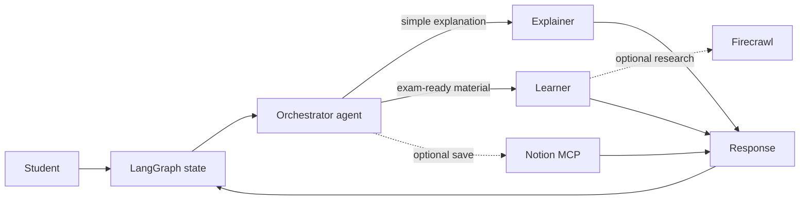

# Multi-Agent Learning Workflow

A supervisor-style learning assistant built with LangGraph, LangChain, and Google Gemini. An orchestrator delegates each request to the teaching style that best matches the student's intent.



## Responsibilities

| Component | Responsibility |
| --- | --- |
| `MultiAgentWorkflow` | Owns graph construction, thread configuration, in-memory checkpointing, and chat state |
| `OrchestratorAgent` | Interprets intent and selects a specialist tool |
| `ExplainerAgent` | Gives short, analogy-driven beginner explanations |
| `LearnerAgent` | Produces detailed, structured, exam-oriented material |
| Firecrawl tool | Optionally retrieves current external sources |
| Notion MCP tool | Optionally writes requested notes below a configured Notion page |

## Setup

From this directory:

```bash
uv sync
cp .env.example .env
```

Set the one credential required for the core workflow:

```dotenv
GOOGLE_API_KEY=your_google_ai_studio_key
```

Start an interactive conversation:

```bash
uv run python main.py
```

Or send a one-shot query:

```bash
uv run python main.py "Explain deadlocks simply"
uv run python main.py "Write an exam-ready answer about database normalization"
```

Conversation memory is process-local and in-memory. Closing the application clears it.

## Optional Firecrawl research

Add this to `.env`:

```dotenv
FIRECRAWL_API_KEY=your_firecrawl_key
```

When the key is absent, the learner agent is created without the Firecrawl tool. When present, the agent may use it for current information, authoritative definitions, case studies, or real-world applications.

## Optional Notion persistence

Configure all three values:

```dotenv
MCP_SERVER_URL=http://localhost:3000/mcp
PARENT_PAGE_ID=your_notion_parent_page_id
MCP_AUTH_TOKEN=choose_a_local_auth_token
```

Create a Notion integration, connect it to the parent page, and start the MCP server in another terminal:

```bash
NOTION_TOKEN="your_notion_token" npx @notionhq/notion-mcp-server \
  --transport http \
  --port 3000 \
  --auth-token "choose_a_local_auth_token"
```

Start the assistant and ask it to save the generated notes. The save tool is not exposed unless every required MCP setting exists.

## Execution flow

1. `main.py` loads local configuration and creates `MultiAgentWorkflow`.
2. Each user message is appended to typed LangGraph state.
3. The orchestrator's ReAct loop inspects the conversation and chooses a tool.
4. The selected specialist runs with its own system instructions.
5. Optional tools may enrich or persist output when configured and requested.
6. The specialist result returns through the orchestrator and is checkpointed under the current thread ID.

## Operational boundaries

- Model output can be inaccurate; verify high-stakes educational material.
- Firecrawl sends the search query to an external service.
- Saving notes changes an external Notion workspace; use a dedicated test page first.
- The in-memory checkpointer is suitable for demonstration, not durable production storage.
- Current exception handling returns a friendly fallback, but production systems should add tracing, timeouts, retries, and redaction.

Return to the [repository overview](../README.md).
