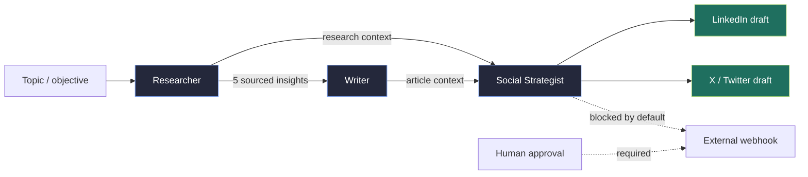
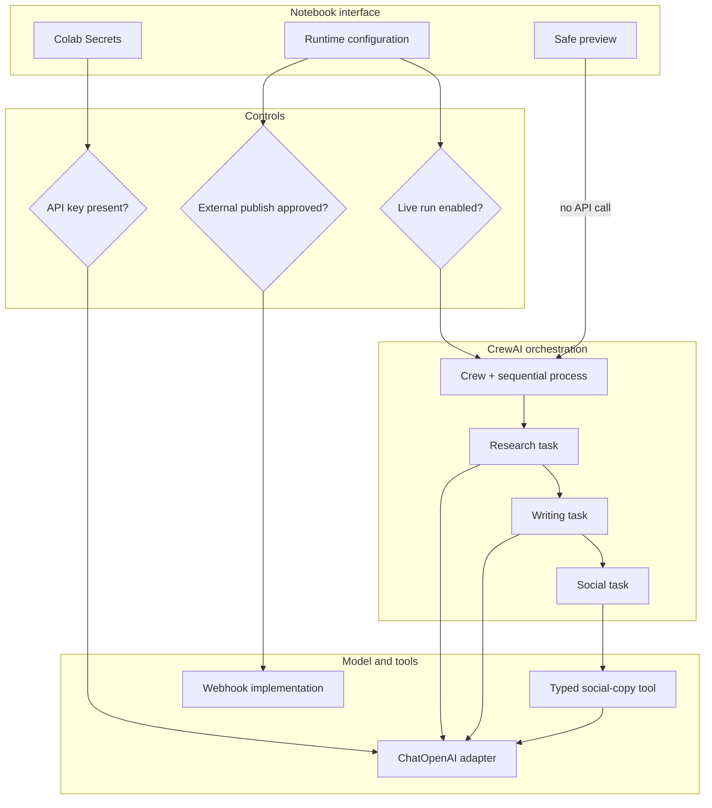

# CrewAI Agentic Content Workflow

Best of Both Worlds: CrewAI

CrewAI: Collaborative Agent Framework

CrewAI is a powerful framework for creating collaborative agent systems where multiple AI agents work together to accomplish complex tasks.

<p align="center">
  
  
  
  
  
  
  
</p>

> A teaching-oriented, Colab-ready reconstruction of a CrewAI workflow that researches a topic, writes an evidence-aware article, and prepares social-media drafts through three specialized agents.

## Navigate

| Page | Purpose |
|---|---|
| **This README** | Project, product, technical, functional, and operational overview |
| [Agentic systems lifecycle](docs/agentic-systems-lifecycle.md) | The nine-stage AILaunchPad journey: what, why, how, and when |
| [Agent architectures and framework landscape](docs/agent-architectures-and-frameworks.md) | Single vs. multi-agent guidance and a current framework comparison |
| [From framework choice to CrewAI implementation](docs/crewai-framework-to-implementation.md) | Framework selection and a production-minded walkthrough of this CrewAI workflow |
| [Executable notebook](crewai_multi_agent_content_workflow_colab.ipynb) | Safe-preview and opt-in live CrewAI implementation |

## What is this project?

The project demonstrates an **integrated content workflow**: one business objective is decomposed into research, writing, and distribution preparation. Each stage has a dedicated role, an explicit output contract, and a controlled hand-off to the next stage.

It is simultaneously:

- a **product prototype** for repeatable research-led content production;
- a **technical reference** for role-based CrewAI orchestration;
- a **learning artifact** for agent/task/context/tool design; and
- a **safety baseline** that separates content generation from external publishing.

The source material came from overlapping Colab screenshots and the AILaunchPad visual sequence. Duplicate execution fragments were consolidated; reconstructable code and workflow intent were retained. Small additions make the notebook runnable without live keys and safer to extend.

## Why agents?

A single prompt can produce an article, but it blurs responsibilities: research quality, editorial quality, channel adaptation, and action permissions are all mixed together. Specialized agents make those boundaries explicit.

| Product concern | Agentic response | Resulting benefit |
|---|---|---|
| Research and writing require different success criteria | Separate Researcher and Writer roles | Easier evaluation and prompt refinement |
| Downstream work must reuse upstream evidence | Task context carries prior outputs | Less repetition and clearer provenance |
| Social channels require different formats | Social Strategist uses a channel-aware tool | Reusable LinkedIn/X transformation |
| Publishing is a high-impact side effect | Publishing is excluded from the agent and double-gated | Human control is preserved |
| Failures are difficult to diagnose in one giant prompt | Each task has an expected output and trace boundary | Better observability and recovery |

Multi-agent design is justified only when this separation improves quality, governance, parallelism, or maintainability enough to offset additional latency, tokens, state, and failure modes. See [when to choose each architecture](docs/agent-architectures-and-frameworks.md#decision-guide).

## Product view

### User outcome

Given a topic, the system should return:

1. five evidence-based research insights with source references;
2. a concise, structured Markdown article grounded in those notes;
3. one LinkedIn draft and one X/Twitter draft; and
4. an explicit statement that nothing was published.

### Intended users

- content and product-marketing teams needing repeatable first drafts;
- analysts who want a visible research-to-narrative chain;
- data/AI practitioners learning multi-agent orchestration; and
- platform teams evaluating permissions, observability, and human approval patterns.

### Non-goals

- autonomous publication by default;
- treating model-generated citations as verified evidence;
- replacing subject-matter or editorial review;
- real-time research without an approved retrieval/search tool; or
- presenting a notebook demo as a production deployment architecture.

## End-to-end functional flow



The process is **sequential**. Research must exist before writing; the social task needs the article and optionally the underlying research. This is a deterministic workflow shell around probabilistic model calls.

## Agents and interaction model

| Agent | Responsibility | Inputs | Output contract | Tools | Permission boundary |
|---|---|---|---|---|---|
| **Researcher** | Find five current, credible insights | Topic and research instructions | Five interpreted bullets, each with source name and URL | LLM; production version should add approved retrieval | Read-only; no publishing |
| **Writer** | Synthesize without adding unsupported claims | Research task output | 250–300 word Markdown article with title, summary, sections, conclusion, sources | LLM | Content creation only |
| **Social Media Strategist** | Adapt article to each channel | Research and article context | LinkedIn draft, X draft, `not published` status | `make_social_copy` | No webhook tool attached in the safe design |

### Interaction semantics

- **Role** defines identity and domain responsibility.
- **Goal** defines what successful behavior looks like.
- **Backstory** provides stable decision context without overloading each task.
- **Task description** defines the work and constraints for one run.
- **Expected output** acts as a lightweight acceptance contract.
- **Context** establishes directed dependencies between tasks.
- **Process** determines scheduling; this notebook uses `Process.sequential`.
- **Tools** are capabilities, not merely helper functions. Attaching a tool grants an agent permission to request its action.

This follows the AILaunchPad distinction between a shared world state and agent-local working context:

### World State: Shared vs Local Memoy

```text
+------------------------------------+---------------------------------------------+
| Shared Context Store               | Per-Agent Scratchpads                       |
| Use global state (central blackboard) | Each agent keeps private short-term memory |
| accessible by all agents           | (only relevant to itself)                   |
+------------------------------------+---------------------------------------------+
| Synchronization                    | TTL & Cleanup                               |
| Shared state ensures no agent misses | Apply time-to-live or Cleaner agent to     |
| updates; local memory for internal  | prune stale info for token efficiency      |
| calculation                        |                                             |
+------------------------------------+---------------------------------------------+
```

## Technical architecture



### Libraries and why they are present

| Library / service | Icon | Role in the notebook | Why this choice | Production note |
|---|---:|---|---|---|
| [Python](https://www.python.org/) | 🐍 | Implementation language | Strong AI ecosystem and readable orchestration code | Pin a supported Python version |
| [Jupyter](https://jupyter.org/) | 📓 | Executable narrative | Code, explanation, outputs, and interpretation coexist | Move reusable logic into packages as the system grows |
| [Google Colab](https://colab.research.google.com/) | 🟨 | Hosted notebook runtime and secret access | Low-friction learning and sharing | Ephemeral runtime; not a durable service host |
| [CrewAI](https://github.com/crewAIInc/crewAI) | 🤖 | Agents, tasks, crews, processes, and tools | Role/task abstractions map naturally to this workflow | Pin versions and test prompts/tools on upgrades |
| [LangChain OpenAI](https://github.com/langchain-ai/langchain) | 🦜 | `ChatOpenAI` model adapter retained from the source | Familiar model interface and configuration | CrewAI can also use its native LLM abstraction |
| [OpenAI API](https://platform.openai.com/docs/) | ✨ | Model inference for agents and social-copy generation | Capable general reasoning and generation | Apply budgets, redaction, retries, and model governance |
| [Pydantic](https://docs.pydantic.dev/) | ✅ | Typed tool argument schemas | Validates the contract between model and executable tool | Treat schemas as versioned APIs |
| [Requests](https://requests.readthedocs.io/) | 🌐 | Optional HTTP webhook implementation | Small, familiar synchronous HTTP client | Add idempotency, authentication, retry policy, and audit logs |
| [pathlib](https://docs.python.org/3/library/pathlib.html) | 📁 | Safe optional image-path handling | Clear file validation and context-managed reads | Restrict tool-accessible directories |

## Notebook structure

| Section | What it teaches | Runtime behavior |
|---|---|---|
| Install dependencies | Colab environment preparation | Installs notebook packages |
| Configuration | Secrets, model selection, live/publish flags | Defaults to no key and no external action |
| Helper implementations | Model call and webhook boundaries | Webhook returns `Not published` by default |
| Typed tools | Tool naming, descriptions, and schemas | Instantiates safe CrewAI tools |
| Agent factory | Role/goal/backstory construction | Delays model client creation until live use |
| Task factory | Output contracts and context hand-offs | Builds the dependency chain |
| Crew factory | Sequential orchestration | Creates the live crew only when requested |
| Structural preview | Key-free validation | Executes locally without an LLM |
| Optional live run | End-to-end orchestration | Requires secret plus explicit opt-in |

## Run in Google Colab

1. Upload or open [the notebook](crewai_multi_agent_content_workflow_colab.ipynb) in Colab.
2. Run the dependency cell; restart the runtime if Colab requests it.
3. Run all remaining cells in **safe preview** mode. No model call or publish occurs.
4. For a live generation test, add `OPENAI_API_KEY` under Colab **Secrets** and grant notebook access.
5. Change `ENABLE_LIVE_RUN = True`, then rerun from configuration onward.
6. Inspect sources and claims manually. Publishing remains disabled.

Do not put production keys directly in notebook cells, outputs, screenshots, or version control.

## Safety and governance model

The notebook applies **capability scoping**: an agent should receive only the tools necessary for its role. The supplied slides describe this as least privilege.

```text
+------------------+----------------------------------------------+
| Agent Role       | Permissions                                  |
+------------------+----------------------------------------------+
| Data Agent       | Read-only database access, no internet       |
| Coder Agent      | Code execution in sandbox only               |
| Writer Agent     | Internet read-only, no database access       |
| Orchestrator     | Full coordination, limited tool execution    |
+------------------+----------------------------------------------+
```

| Control | Current implementation | Recommended production evolution |
|---|---|---|
| Secret handling | Environment/Colab Secrets; no embedded key | Managed secret store, rotation, scoped credentials |
| Live inference | `ENABLE_LIVE_RUN=False` | Environment policy plus per-run budget |
| External publishing | Disabled and absent from the social agent's tools | Human approval, signed request, idempotency key, audit record |
| Citation integrity | Prompt requires URLs and flags uncertainty | Retrieval allowlist, URL resolution, claim-evidence validation |
| File handling | Optional path must exist; context-managed open | Sandboxed directory and content scanning |
| Error handling | Clear precondition failures | Typed error taxonomy, retry/backoff, dead-letter queue |
| Traceability | CrewAI verbose trace in live mode | Trace IDs, redaction, span store, cost and latency telemetry |

## Observability and evaluation

“The workflow ran” is not the same as “the workflow was correct.” Measure both orchestration health and product quality.

| Layer | Example metrics | Example evaluation |
|---|---|---|
| System | latency, token cost, retries, tool errors | load and failure-injection tests |
| Coordination | steps per task, hand-offs, loop rate | correct agent selection and termination |
| Research | URL validity, source diversity, claim coverage | human/automated claim-evidence checks |
| Article | grounded-claim rate, structure, length | rubric plus golden-set comparison |
| Social output | platform fit, factual consistency, CTA quality | channel-specific rubric |
| Safety | blocked publishes, secret exposure, policy violations | adversarial tool and prompt tests |

```text
Tracing Multi-Agent Interactions
+----------------------------------------------------------------------------+
| 1 | Unified Trace IDs                                                     |
|   | Tag messages and actions with task/session ID to correlate across     |
|   | agents                                                               |
+----------------------------------------------------------------------------+
| 2 | Span Logging                                                          |
|   | Treat each agent's step as a span in distributed trace                |
|   | (parent-child relations)                                              |
+----------------------------------------------------------------------------+
| 3 | Causality Tree                                                        |
|   | Build tree of agent calls/tools to see how one agent's output leads  |
|   | to another's action                                                   |
+----------------------------------------------------------------------------+
```

```text
Key Metrics & KPIs
+----------------------------------------------------------------------------+
| Avg Steps Per Task | Track efficiency of agent coordination                   |
+----------------------------------------------------------------------------+
| Success Rate       | Tasks completed without human help                        |
+----------------------------------------------------------------------------+
| Latency            | Monitor end-to-end completion time                         |
+----------------------------------------------------------------------------+
| Stuck Loop Rate    | Measure intervention frequency                             |
+----------------------------------------------------------------------------+
```

## Productization roadmap

### Stage 1 — validated notebook

- compile and safe-preview checks;
- explicit role/task contracts;
- no automatic publication; and
- manual inspection of live outputs.

### Stage 2 — grounded pilot

- approved search/retrieval connector;
- structured research output schema;
- citation resolver and claim verifier;
- prompt/version registry; and
- trace and cost dashboard.

### Stage 3 — controlled service

- API/UI wrapper with identity and tenancy;
- durable state and resumable execution;
- rate limits, budgets, retries, and dead-letter handling;
- human review queue for content and actions; and
- offline/online evaluation gates in CI/CD.

### Stage 4 — scalable product

- workload isolation and queueing;
- model routing and caching;
- SLOs for quality, latency, availability, and cost;
- policy-as-code and audit retention; and
- rollout, rollback, and incident-response procedures.

## Repository map

```text
.
├── README.md
├── crewai_multi_agent_content_workflow_colab.ipynb
├── docs/
│   ├── agentic-systems-lifecycle.md
│   └── agent-architectures-and-frameworks.md
├── AILaunchPad/          # Concept and framework slides
├── images/               # Source notebook screenshots
├── temp/                 # Additional contextual screenshots
└── zip/Archive.zip       # Original supplied archive (contains unrelated material too)
```

## Key engineering insights

1. **Agent count is an architecture decision, not a quality knob.** More agents add coordination overhead and new failure paths.
2. **Tasks need contracts.** “Write an article” is weaker than a length, structure, evidence, and format contract.
3. **Context is a directed data dependency.** Passing everything everywhere increases tokens and contamination risk.
4. **Tools are permissions.** If an agent can call a publishing tool, it effectively has publishing authority unless another control intervenes.
5. **Deterministic shells contain probabilistic work.** State machines, schemas, budgets, checkpoints, and approval gates make model behavior operable.
6. **Evidence must be verified outside the model.** A plausible citation is not necessarily a real or supporting citation.
7. **Observability requires causality.** Trace parent/child relationships across agents, model calls, tools, retries, and human decisions.
8. **Evaluate the whole workflow and every stage.** End-to-end quality can hide a weak researcher or an overconfident writer.

## Further reading

- [Nine-stage agentic systems lifecycle](docs/agentic-systems-lifecycle.md)
- [Single/multi-agent decision guide and framework comparison](docs/agent-architectures-and-frameworks.md)
- [CrewAI official repository](https://github.com/crewAIInc/crewAI)
- [CrewAI examples](https://github.com/crewAIInc/crewAI-examples)
- [AILaunchPad detailed notebook map](AILaunchPad/38.png)

---

This repository is an educational reconstruction. Framework APIs, platform status, and adoption signals change; consult the linked official sources before making production or procurement decisions.
