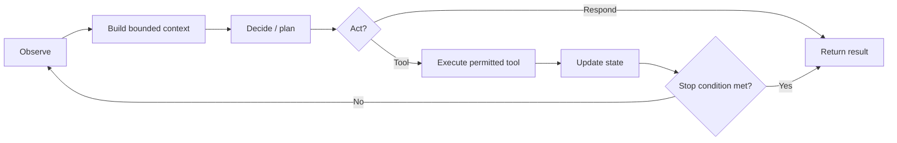

# Agent Architectures and Framework Landscape

[← Project README](../README.md) · [Agentic systems lifecycle](agentic-systems-lifecycle.md)

This page answers two different questions:

1. **Architecture:** should the product use deterministic software, one agent, several agents, or a hybrid?
2. **Implementation:** which framework or supporting platform best expresses that architecture?

The architecture decision comes first. A framework can accelerate implementation, but it cannot make an unnecessary multi-agent design economical or a poorly bounded agent safe.

## Executive summary

| Approach | What | Why | How | When |
|---|---|---|---|---|
| Deterministic workflow | Code/rules call models only for bounded transformations | Maximum predictability and testability | DAG/state machine plus typed model calls | Process and branches are known |
| Single agent | One model-driven controller chooses tools/steps | Flexible reasoning with minimal coordination | Instructions, bounded tool loop, memory, guardrails | One coherent objective and permission set |
| Multi-agent | Specialized controllers communicate/delegate | Separation, parallelism, verification, permissions | Supervisor, graph, crew, group chat, or event runtime | Responsibilities are genuinely heterogeneous |
| Hybrid | Deterministic shell around one or more agentic regions | Balances flexibility and operational control | Explicit state machine; agents inside bounded nodes | Most production business workflows |

The **hybrid** is the default recommendation for production: deterministic code owns identity, state transitions, policy, approvals, retries, and side effects; agents handle interpretation, research, planning, synthesis, and other probabilistic work within bounded contracts.

## What counts as an agent?

An agent is a software component that receives observations, reasons toward a goal, chooses among permitted actions, acts through tools, and updates state until a completion rule is met. An LLM call is not automatically an agent. A function that always maps one typed input to one output is usually better treated as a deterministic component.



## Single-agent systems

### What

One agent owns the task and may call multiple deterministic tools. The agent can plan internally, but there is no A2A protocol or separate specialist identity.

### Why

- lowest orchestration and serialization overhead;
- one conversation/state owner;
- easier tracing, evaluation, and cancellation;
- fewer repeated model calls and context inconsistencies; and
- simpler authorization when all actions share one permission boundary.

### How

1. Define one narrow goal and a small, typed toolset.
2. Keep policy and authorization outside the prompt.
3. Bound tool iterations, time, tokens, and spend.
4. Separate durable state from transient context.
5. Validate final output and every external action.

### When

Use one agent when the task is cohesive, the same evidence and permissions apply throughout, tools are few, and independent specialist evaluation is unnecessary. Examples: support triage over one knowledge base, document extraction with validation, or a coding assistant operating inside one sandbox.

### Warning signs that one agent is overloaded

- prompt contains many conflicting roles and policies;
- context repeatedly exceeds useful limits;
- different task stages need different credentials;
- tool selection quality drops as the toolset grows;
- one failure requires rerunning unrelated work; or
- separate teams need to own and evaluate separate behaviors.

## Multi-agent systems

### What

Multiple agents have distinct roles, models, tools, memory scopes, or permissions and coordinate through explicit messages, task dependencies, shared state, or a supervisor.

### Why

- domain specialization;
- separation of duties and least privilege;
- parallel independent work;
- maker/checker or debate/judge verification;
- independent lifecycle, ownership, and evaluation; and
- graceful replacement or degradation of a failed specialist.

### How

1. Decompose by responsibility—not by arbitrary prompt sections.
2. Choose one coordination topology.
3. Define typed hand-offs, state ownership, and provenance.
4. Give each role minimum context and capabilities.
5. Bound global and per-agent loops/budgets.
6. Trace causal relationships and evaluate components plus the whole.

### When

Use multiple agents when different stages have materially different tools, expertise, security boundaries, latency opportunities, ownership, or success rubrics. Examples: research → analysis → compliance review; incident triage with specialist responders; or parallel due-diligence tracks consolidated by a reviewer.

## Multi-agent coordination patterns

| Pattern | Shape | How it works | Strong fit | Main failure mode |
|---|---|---|---|---|
| Sequential specialists | `A → B → C` | Each role transforms the prior artifact | Content pipeline, approvals | Error propagation |
| Router + specialists | `R → {A,B,C}` | Router selects domain expert | Support, intent handling | Misrouting |
| Supervisor + workers | `S ↔ workers` | Supervisor decomposes and consolidates | Open-ended projects | Supervisor bottleneck |
| Parallel fan-out/fan-in | `P → {A,B,C} → J` | Independent work merged by judge | Research, comparison | Duplicate work/correlation |
| Maker–checker | `M → C → revise` | Reviewer validates against rubric | High-accuracy artifacts | Endless revision loop |
| Debate/vote/judge | `A ↔ B → J` | Multiple proposals are arbitrated | Ambiguous reasoning | Cost and shared bias |
| Blackboard | `agents ↔ shared state` | Agents contribute to common world state | Planning/simulation | Race and stale writes |
| Event-driven actors | `events → subscribers` | Typed asynchronous messages drive work | Distributed long-running systems | Delivery and causality complexity |

<p align="center">
  
  
</p>

## Decision guide

Score each statement `0 = no`, `1 = somewhat`, `2 = strongly`.

| Decision signal | Score |
|---|---:|
| Stages require different data or tool permissions | 0–2 |
| Independent branches can reduce end-to-end latency | 0–2 |
| Stages need different models, prompts, owners, or evaluations | 0–2 |
| Independent critique materially reduces high-impact errors | 0–2 |
| Context can be partitioned without losing essential meaning | 0–2 |
| Failure of one specialist should not restart the whole process | 0–2 |
| Dynamic delegation is genuinely required | 0–2 |

Interpretation:

- **0–3:** deterministic workflow or one agent;
- **4–7:** one agent inside a deterministic workflow, or a small two-role design;
- **8–14:** multi-agent may be justified—validate it against a baseline.

This is a design prompt, not a scientific score. Final selection should use task-success, quality, latency, cost, incident, and maintenance evidence.

## Framework landscape

### Read this before comparing numbers

- **GitHub stars are an adoption-interest proxy, not active users, production deployments, quality, or support.** Counts below are rounded snapshots checked **9 August 2026** from official repositories and will change.
- **Launch year** is the first public project/repository release signal, not necessarily company formation or 1.0 GA.
- **Fit ratings** are an editorial rubric for fast comparison: `1 = weak`, `3 = capable with trade-offs`, `5 = especially strong`. They are not marketplace/customer ratings.
- LangSmith is an observability/evaluation platform, and Qdrant is a vector database. They complement an agent framework; they do not replace orchestration.
- Official repositories now describe **AutoGen as maintenance-mode** and **Microsoft Agent Framework** as the successor to both AutoGen and Semantic Kernel for new Microsoft-stack agent development. Existing systems still need deliberate migration analysis.

### Positioning and adoption

| Technology | Category | Public launch | Languages | What it is best known for | Adoption signal (rounded) | Current-use note |
|---|---|---:|---|---|---:|---|
| [LangGraph](https://github.com/langchain-ai/langgraph) | Stateful orchestration framework | 2023 | Python, JS/TS | Explicit graphs, durable execution, memory, human-in-loop | **39.3k** GitHub stars | Strong when state transitions and recovery must be explicit |
| [LangSmith](https://github.com/langchain-ai/langsmith-sdk) | Observability/evaluation platform | 2023 | Python, JS/TS SDKs | Tracing, datasets, evaluations, monitoring | **0.9k** SDK stars | Framework-neutral; often paired with LangGraph/LangChain |
| [CrewAI](https://github.com/crewAIInc/crewAI) | Role/task agent framework | 2023 | Python | Agents, tasks, crews, processes, flows | **56.8k** GitHub stars | Fast mapping from business roles to collaborative workflows |
| [LlamaIndex](https://github.com/run-llama/llama_index) | Data/RAG and agentic application framework | 2022 | Primarily Python; TS ecosystem | Connectors, indexing, retrieval, document agents/workflows | **51.5k** GitHub stars | Especially strong for data- and document-centric agents |
| [AutoGen](https://github.com/microsoft/autogen) | Conversational/event-driven multi-agent framework | 2023 | Python, .NET | AgentChat, group conversations, extensible runtimes | **60.3k** GitHub stars | Maintenance mode; official repo directs new users to Microsoft Agent Framework |
| [Semantic Kernel](https://github.com/microsoft/semantic-kernel) | Enterprise model/agent SDK | 2023 | .NET, Python, Java | Plugins, process integration, Microsoft/Azure application stack | **28.4k** GitHub stars | Official transition path is Microsoft Agent Framework |
| [Microsoft Agent Framework](https://github.com/microsoft/agent-framework) | Successor enterprise agent framework | 2025 | Python, .NET | Unified orchestration/deployment, A2A/MCP, Microsoft ecosystem | Newer project | Evaluate first for greenfield Microsoft-stack builds |
| [Qdrant](https://github.com/qdrant/qdrant) | Vector database/search engine | 2020 | Rust server; multi-language clients | Filtered vector/hybrid retrieval at scale | **33.9k** GitHub stars | Agent memory/retrieval infrastructure, not an orchestrator |

CrewAI also publicly reported in October 2024 that its platform powered more than 10 million agents per month and was used by an estimated nearly half of the Fortune 500. Treat vendor-reported usage separately from the comparable open-source interest proxy above.

### Editorial fit ratings

| Technology | Prototype speed | Orchestration control | Native multi-agent ergonomics | Data/RAG depth | Production operations | Learning curve |
|---|:---:|:---:|:---:|:---:|:---:|:---:|
| LangGraph | ★★★ | ★★★★★ | ★★★★ | ★★★★ | ★★★★★ | ★★ |
| LangSmith | N/A | N/A | N/A | N/A | ★★★★★ | ★★★★ |
| CrewAI | ★★★★★ | ★★★★ | ★★★★★ | ★★★ | ★★★★ | ★★★★ |
| LlamaIndex | ★★★★ | ★★★★ | ★★★★ | ★★★★★ | ★★★★ | ★★★ |
| AutoGen | ★★★★ | ★★★★ | ★★★★★ | ★★★ | ★★ | ★★★ |
| Semantic Kernel | ★★★ | ★★★★ | ★★★★ | ★★★★ | ★★★★ | ★★★ |
| Microsoft Agent Framework | ★★★★ | ★★★★★ | ★★★★★ | ★★★★ | ★★★★★ | ★★★ |
| Qdrant | N/A | N/A | N/A | ★★★★★ | ★★★★★ | ★★★★ |

“Production operations” covers lifecycle status, durable execution/integration surface, observability/deployment support, and enterprise-operability—not a claim that default applications are automatically production-ready. AutoGen's lower score reflects its officially stated maintenance status, not its historical importance or technical depth.

## Framework-by-framework: what, why, how, when

### LangGraph + LangSmith

| Lens | Guidance |
|---|---|
| **What** | LangGraph is a low-level graph runtime for long-running, stateful agents. LangSmith supplies tracing, evaluation, datasets, and monitoring. |
| **Why** | Graph nodes/edges expose control, state transitions, cycles, interrupts, checkpointing, and human review. |
| **How** | Define typed shared state; implement nodes; connect normal/conditional edges; configure persistence; trace/evaluate through LangSmith. |
| **When** | Choose it when workflow state, resumability, branching, or fine-grained orchestration matters more than role-play convenience. |

Trade-off: flexibility demands more architecture and explicit state design. LangSmith is useful independently, but it is a service/platform choice with data-governance and cost implications.

<p align="center">
  
</p>

### CrewAI

| Lens | Guidance |
|---|---|
| **What** | A Python framework centered on agents, tasks, crews, processes, tools, and flows. |
| **Why** | Business roles and delegated work map cleanly to its abstractions, making collaborative prototypes readable. |
| **How** | Define role/goal/backstory, assign tasks and expected outputs, connect context, attach scoped tools, select process, then run the crew/flow. |
| **When** | Choose it for specialist teams, sequential/hierarchical content and business workflows, and rapid role-oriented prototyping. |

Trade-off: do not let role metaphors replace typed contracts, deterministic state, or infrastructure controls. Use Flows or an external workflow layer when execution paths need more precise control.

<p align="center">
  
</p>

### LlamaIndex

| Lens | Guidance |
|---|---|
| **What** | A data framework for agentic applications with extensive connectors, ingestion, parsing, indexing, retrieval, query engines, tools, and workflows. |
| **Why** | It shortens the path from private/unstructured data to grounded agent context. |
| **How** | Ingest and parse sources; build indices/retrievers; expose them as tools; compose agents/workflows; evaluate retrieval and response grounding. |
| **When** | Choose it for document agents, enterprise knowledge, multimodal parsing, RAG-heavy systems, and retrieval experimentation. |

Trade-off: data quality, chunking, metadata, access control, freshness, and evaluation remain application responsibilities.

### AutoGen

| Lens | Guidance |
|---|---|
| **What** | A historically influential framework for conversational agents, group chat, event-driven runtimes, tools, and human participation. |
| **Why** | It made complex multi-agent conversation patterns approachable and extensible. |
| **How** | Existing systems use Core/AgentChat/extensions and termination/group-chat patterns. |
| **When** | Maintain or migrate an existing AutoGen estate; use for research/legacy compatibility where its semantics are specifically required. |

Current caveat: the official repository states that AutoGen is community-managed and in maintenance mode, and recommends Microsoft Agent Framework for new projects.

### Semantic Kernel and Microsoft Agent Framework

| Lens | Guidance |
|---|---|
| **What** | Semantic Kernel is Microsoft's model-agnostic SDK for plugins, agents, memory, and processes. Microsoft Agent Framework unifies lessons from Semantic Kernel and AutoGen for current agent development. |
| **Why** | Strong fit for applications already using .NET/Azure/Microsoft identity, dependency injection, enterprise support, and multi-language integration. |
| **How** | Register model services and plugins, construct agents/workflows, enforce application-layer controls, and deploy through the chosen Microsoft hosting stack. |
| **When** | Evaluate Microsoft Agent Framework for new Python/.NET agent systems; retain/migrate Semantic Kernel according to support and compatibility needs. |

Trade-off: cloud/enterprise ecosystem advantages can introduce service coupling. Verify feature parity and migration status for the exact language/runtime before committing.

### Qdrant

| Lens | Guidance |
|---|---|
| **What** | A Rust-based vector similarity search engine/database with filtering and hybrid retrieval capabilities. |
| **Why** | Agents need fast, scoped access to semantic memory and enterprise knowledge beyond prompt windows. |
| **How** | Embed documents/events, store vectors plus authorization/freshness metadata, retrieve with filters, rerank, and pass only relevant evidence to agents. |
| **When** | Use when semantic retrieval, recommendations, memory, or RAG require a dedicated production vector store. |

Qdrant does not plan, route, or coordinate agents. It occupies the **knowledge/memory layer** beneath frameworks such as CrewAI, LangGraph, LlamaIndex, or Microsoft Agent Framework.

## Choosing by product requirement

| Requirement | First technology to evaluate | Why |
|---|---|---|
| Readable business-role workflow | CrewAI | Direct agent/task/crew vocabulary |
| Fine-grained state machine, cycles, interrupts | LangGraph | Explicit graph and durable state model |
| Evaluation and trace platform across stacks | LangSmith | Framework-neutral observability/evaluation focus |
| Document parsing, connectors, and RAG | LlamaIndex | Data-centric toolkit and integrations |
| Greenfield Microsoft/Azure agent system | Microsoft Agent Framework | Current consolidated Microsoft direction |
| Existing AutoGen system | AutoGen migration assessment | Preserve behavior while planning successor path |
| Existing Semantic Kernel application | SK/MAF compatibility assessment | Avoid unnecessary rewrite; follow official migration guidance |
| High-scale vector/hybrid retrieval | Qdrant | Dedicated vector database and filtering |
| Simple SaaS integration without deep agent logic | n8n, Zapier, or Make | Visual connectors and bounded workflows |
| Strict regulated process | Deterministic workflow + bounded agent nodes | Explicit policy, state, approval, and audit control |

## Example reference stacks

### Research-led content product

```text
Colab/UI → CrewAI flow → approved search/retrieval → Qdrant (optional memory)
         → model provider → citation verifier → human review → publisher
         → tracing/evaluation platform
```

### Long-running case-management product

```text
API → identity/policy → durable workflow or LangGraph/MAF
    → specialist agents → enterprise tools
    → checkpoint store + queue + Qdrant
    → human approval → idempotent side effects
    → traces, metrics, evaluations, audit archive
```

## Procurement and architecture questions

Before selecting a framework or managed platform, ask:

1. Can workflows resume after process/model/tool failure without repeating side effects?
2. Are state, message, task, and tool schemas versionable?
3. Can each agent receive different credentials and data scopes?
4. How are human interrupts, cancellation, timeouts, and budgets represented?
5. Can traces be exported, redacted, sampled, and retained under policy?
6. Is evaluation supported at component and end-to-end levels?
7. What is the framework's release/support/migration policy?
8. Can models, vector stores, and observability providers be replaced?
9. What telemetry leaves the environment by default or opt-in?
10. What are the operational costs at realistic concurrency and failure rates?

## Source notes

Current positioning and adoption signals were checked against primary project sources:

- [LangGraph official repository](https://github.com/langchain-ai/langgraph) — stateful orchestration, durable execution, memory, and current stars.
- [LangSmith SDK repository](https://github.com/langchain-ai/langsmith-sdk) — tracing/evaluation positioning.
- [CrewAI official repository](https://github.com/crewAIInc/crewAI) — agent/task/crew/flow positioning and current stars.
- [CrewAI October 2024 company update](https://blog.crewai.com/crewai-building-the-agentic-future-together/) — vendor-reported usage claim.
- [LlamaIndex official repository](https://github.com/run-llama/llama_index) — 2022 citation, data/agent positioning, integrations, and current stars.
- [AutoGen official repository](https://github.com/microsoft/autogen) — maintenance status, architecture, successor guidance, and current stars.
- [Microsoft Research AutoGen launch](https://www.microsoft.com/en-us/research/blog/autogen-enabling-next-generation-large-language-model-applications/) — September 2023 public introduction.
- [Semantic Kernel official repository](https://github.com/microsoft/semantic-kernel) and [one-year retrospective](https://devblogs.microsoft.com/semantic-kernel/reflecting-on-a-year-of-progress-microsoft-semantic-kernel-turns-one/) — capabilities and March 2023 public launch.
- [Microsoft Agent Framework official repository](https://github.com/microsoft/agent-framework) and [successor announcement](https://devblogs.microsoft.com/semantic-kernel/semantic-kernel-and-microsoft-agent-framework/) — current Microsoft direction.
- [Qdrant official repository](https://github.com/qdrant/qdrant) — vector database positioning and current stars.

Framework features, licenses, lifecycle status, and counts change. Re-check official documentation and repository metadata at decision time.
