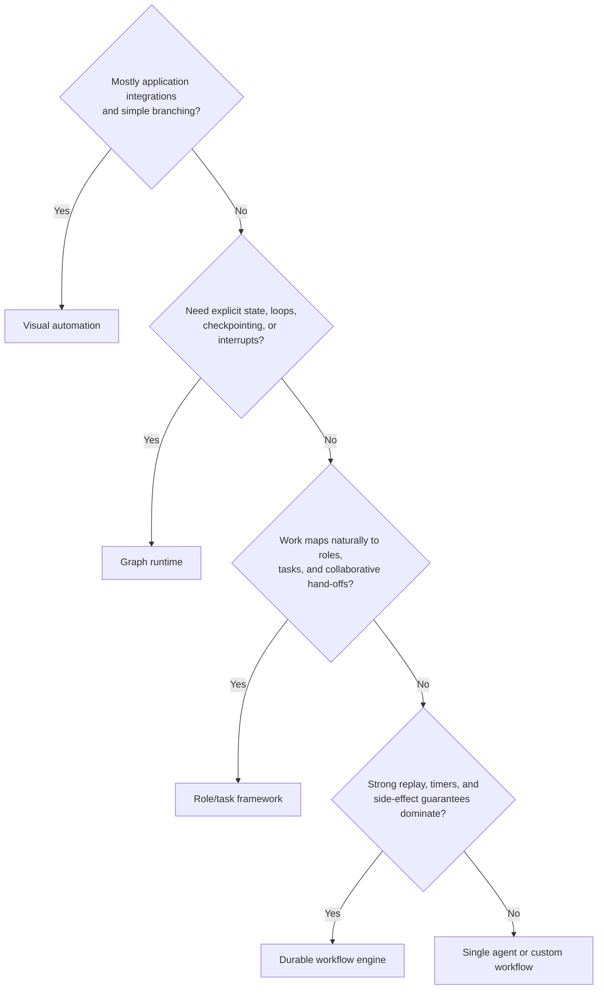
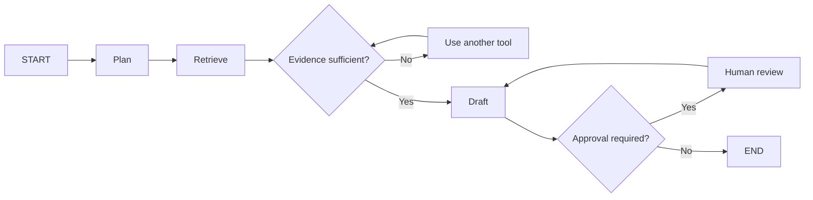
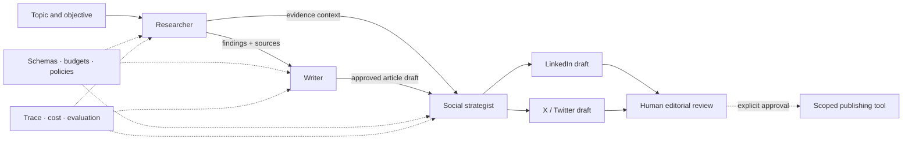
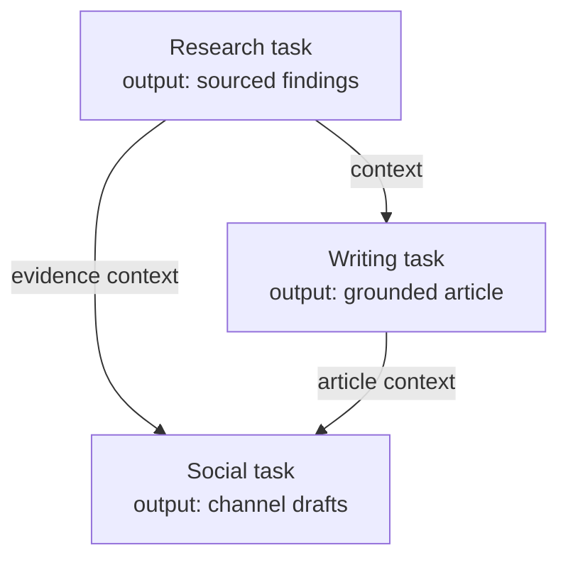

# From Framework Choice to CrewAI Implementation

This guide bridges agentic-system design principles and a practical CrewAI implementation. It explains how to select an orchestration approach, how CrewAI models collaborative work, and how the `crew-scribe` research-to-content pipeline turns that model into an executable workflow.

For the underlying coordination, memory, safety, observability, and reliability principles, begin with the [Agentic Systems overview](../../AILaunchPad/README.md). For project-specific setup and execution, use the [crew-scribe README](../README.md).

## 1. Choose the orchestration abstraction

Start from workflow requirements, not framework popularity.

| Approach | Best suited to | Primary strength | Main trade-off |
| --- | --- | --- | --- |
| **Visual automation** | integration-heavy business workflows, triggers, approvals, straightforward branching | rapid delivery and broad connector catalogs | complex state, testing, versioning, and custom control can become difficult |
| **Graph-based runtime** | long-running, stateful workflows with loops, branches, persistence, and human interruption | explicit state transitions and fine-grained control | higher engineering and operating ownership |
| **Role/task agent framework** | collaborative work naturally expressed as specialists, assignments, and hand-offs | clear domain model and fast composition | overlapping roles and unconstrained delegation can increase chatter and cost |
| **Durable workflow engine** | regulated, timer-heavy, or side-effect-heavy processes requiring strong replay semantics | deterministic execution, retries, timers, and recovery | agent behavior must be integrated as bounded activities |
| **Custom orchestration** | highly specialized constraints not served by existing abstractions | maximum flexibility | maximum implementation, testing, and maintenance burden |



These approaches can be combined. A durable workflow may own scheduling and side effects, a graph may manage stateful reasoning, and a crew may perform a bounded collaborative activity.

## 2. Visual automation: speed and accessibility

Platforms such as n8n, Zapier, and Make represent workflows as connected triggers, actions, conditions, and integrations. They are useful when the process is dominated by moving data among business systems and when non-developers need to inspect or modify the flow.

Use visual automation when:

- connectors and event triggers are more important than custom reasoning;
- branches are understandable on a canvas;
- state is small and short-lived;
- built-in credential and approval handling meets the risk profile; and
- platform limits, exportability, testing, and cost are acceptable.

As the workflow gains nested loops, rich shared state, many agents, custom concurrency, or complex recovery, a code-first abstraction usually becomes easier to reason about and test.

## 3. Code-first orchestration and graph runtimes

Code-first frameworks provide typed interfaces, source control, modular testing, custom tools, and precise state management. They require stronger software engineering practices, but give teams direct control over schemas, routing, persistence, telemetry, and failure handling.

A graph runtime models the application as:

- **state:** the typed data contract carried through execution;
- **nodes:** model calls, tools, validations, human reviews, or deterministic functions;
- **edges:** unconditional or conditional transitions;
- **checkpoints:** durable snapshots used for recovery and inspection; and
- **interrupts:** controlled pauses for external input or human approval.



This style is a strong fit when transitions and state semantics must remain explicit. It is less valuable when the domain is better communicated through named specialists and their assignments.

## 4. Why CrewAI fits this project

The content workflow decomposes naturally into stable professional roles. CrewAI gives those roles a direct implementation model:

| CrewAI concept | Meaning in this project |
| --- | --- |
| **Agent** | a specialist with a role, goal, operating instructions, model, and bounded tools |
| **Task** | a work contract with a description, expected output, assigned agent, and upstream context |
| **Crew** | the collaborating group plus its process and execution settings |
| **Process** | the sequencing or hierarchy that determines task execution and delegation |
| **Tool** | a typed capability the agent may invoke, such as search or channel formatting |
| **Context** | explicit outputs from earlier tasks supplied to downstream work |

CrewAI is appropriate here because research, editorial synthesis, and channel adaptation have distinct goals and acceptance criteria. The framework makes specialization and hand-offs visible without requiring every transition to be built as a low-level graph.

## 5. Target outcome

Given a topic, the workflow produces:

1. a compact set of evidence-aware research findings;
2. a structured article grounded in those findings;
3. channel-appropriate LinkedIn and X/Twitter drafts; and
4. a clear statement that no content was externally published.

Publishing remains outside the default autonomous boundary. A human may review and explicitly authorize a separate, idempotent publishing action.

## 6. End-to-end CrewAI workflow



### Researcher

The Researcher turns the topic into verifiable findings. Its contract should require sources, publication or retrieval dates where available, concise evidence summaries, and explicit uncertainty. In a live deployment, it should use an approved search or retrieval tool rather than relying on model memory.

### Writer

The Writer receives the research output as explicit task context. It creates a coherent Markdown article without inventing unsupported evidence. Its expected output should define audience, tone, structure, length, required citations, and prohibited claims.

### Social strategist

The Social Strategist receives both evidence and the article. It adapts the material to channel constraints while preserving factual meaning. Channel formatting is a transformation capability; publishing is a separate capability with a higher risk level.

## 7. Implementation anatomy

The executable notebook is organized into five layers.

### Setup and dependencies

- install or pin compatible CrewAI, model-adapter, and validation libraries;
- load API keys from environment variables or a managed secret store;
- configure models explicitly rather than relying on implicit defaults;
- expose a safe-preview mode that exercises the workflow without external calls; and
- record dependency, model, and prompt versions with each run.

Never commit credentials to notebooks, source files, outputs, or captured traces.

### Typed helper functions and tools

Tools should have narrow names, typed arguments, validated outputs, timeouts, and explicit error behavior. Separate pure transformations from side-effecting operations. A formatting tool may generate social copy safely; a webhook tool requires destination allowlisting, approval, idempotency, and audit logging.

```python
from pydantic import BaseModel, Field


class SocialDraftRequest(BaseModel):
    channel: str = Field(pattern="^(linkedin|x)$")
    source_text: str = Field(min_length=1)
    audience: str = Field(min_length=1)


class SocialDraft(BaseModel):
    channel: str
    copy: str
    published: bool = False
```

Typed contracts reduce ambiguity and make validation, evaluation, and downstream integration easier.

### Agents

Each agent should have one dominant responsibility. Define its role, goal, background, tool allowlist, delegation policy, model, iteration limit, and expected failure behavior. Avoid several agents whose roles differ only in wording; overlapping responsibility creates duplicate work and inconsistent ownership.

### Tasks and context flow

Tasks should specify the required work and the observable acceptance contract. Pass upstream outputs through explicit context relationships instead of repeating them in prompts or expecting the shared transcript to remain authoritative.



### Build and run

Construct agents first, attach them to typed tasks, define a sequential or hierarchical process, then create the crew. Supply run inputs as a schema-controlled object and store the final and intermediate artifacts separately.

A safe execution lifecycle is:

1. validate inputs and configuration;
2. create a trace and establish budgets;
3. execute research and validate source structure;
4. pass accepted findings to the writer;
5. validate grounding and article structure;
6. generate social drafts from accepted context;
7. evaluate the artifacts and request human review; and
8. persist results, metrics, and a non-publishing audit record.

## 8. Sequential versus hierarchical execution

Use a **sequential process** when tasks and hand-offs are known in advance. It is predictable, easy to trace, and well suited to this three-stage content pipeline.

Use a **hierarchical process** when a manager agent must dynamically assign or decompose work. This flexibility adds model calls, delegation ambiguity, and new failure modes, so establish routing criteria, maximum delegation depth, task budgets, and arbitration rules.

Do not add hierarchy merely to make a workflow appear more agentic. Use the least dynamic process that satisfies the requirement.

## 9. Production hardening

The notebook demonstrates orchestration; a production service also needs an execution and governance envelope.

| Area | Production requirement |
| --- | --- |
| Inputs and outputs | Pydantic or JSON Schema contracts, size limits, content classification |
| Evidence | approved retrieval, provenance, citation validation, freshness checks |
| State | durable run records, versioned artifacts, checkpoints, explicit ownership |
| Security | per-agent credentials, tool allowlists, sandboxing, secret redaction |
| Control | token/time/cost/step budgets, timeouts, retries, fallbacks, cancellation |
| Side effects | approval, destination allowlists, idempotency, compensation, audit trail |
| Observability | one trace across tasks, models, tools, policy, state, and approvals |
| Evaluation | scenario tests, groundedness, schema, policy, and channel-quality checks |
| Operations | queues, rate limits, backpressure, dead-letter handling, kill switch |

### Failure and recovery strategy

Classify errors before retrying. Retry transient model or network failures with bounded backoff. Reject invalid inputs without retry. Use fallback models or tools only when their quality and permission profiles are acceptable. Checkpoint accepted task outputs so a failed social transformation does not repeat research and writing.

### Cost strategy

Use a capable model where synthesis quality matters and smaller models for classification, formatting, or validation where evaluations prove they are sufficient. Cache approved research, reuse intermediate artifacts, compact context, and enforce a cumulative run budget.

## 10. Evaluation strategy

Evaluate each boundary independently and the workflow end to end.

| Stage | Example assertions |
| --- | --- |
| Research | required number of findings, valid source shape, relevance, source diversity, freshness |
| Article | schema and length, coverage of findings, citation alignment, unsupported-claim rate |
| Social | channel constraints, factual consistency, required disclosures, no publish action |
| Workflow | correct order, context propagation, budget adherence, trace completeness, graceful failure |

Use a small golden scenario set for regression, adversarial topics for safety, injected dependency failures for recovery, and human review samples for calibration. Gate changes to prompts, tools, models, schemas, and dependencies on agreed evaluation thresholds.

## 11. Explainability in the CrewAI workflow

The workflow should explain its result through inspectable artifacts rather than hidden reasoning. Preserve:

- the original objective and validated inputs;
- agent and task definitions by version;
- the research findings and source provenance used downstream;
- task ownership, hand-offs, status, latency, tokens, and cost;
- policy, validation, and approval outcomes;
- differences introduced during editorial review; and
- confirmation of whether any external action occurred.

The final user-facing response should summarize the workflow followed, cite the evidence supporting material claims, disclose limitations, and identify content that still requires review. Operators and auditors should be able to reconstruct the same outcome from the trace and durable run record.

## 12. Work with the repository

Use these pages in order:

1. [Agentic Systems: From Coordination to Production](../../AILaunchPad/README.md)
2. [Agent architectures and framework landscape](agent-architectures-and-frameworks.md)
3. [crew-scribe project and setup guide](../README.md)
4. [Executable CrewAI notebook](../crewai_multi_agent_content_workflow_colab.ipynb)

The notebook supports safe exploration before live credentials and tools are enabled. Keep content generation and external publication as separate trust boundaries when extending it.

---

**The framework supplies orchestration primitives. Production quality comes from explicit contracts, governed tools, durable state, evaluation, and accountable human control.**
