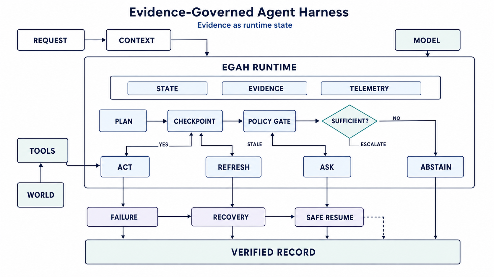

# Evidence-Governed Agent Harness (EGAH)

**A proof-of-concept demonstrating evidence as first-class runtime state in long-running agent workflows**

Evidence checkpoints · Crash recovery · Evidence-governed continuation · Verification history · Resource accounting


[Problem](#problem-statement) · [Solution](#solution-approach) · [Architecture](#architecture) · [10-Step Example](#the-10-step-example) · [Quick Start](#quick-start) · [Commands](#commands-reference) · [Structure](#project-structure) · [Modules](#source-modules) · [Demo](#demo)

---

## Purpose

This PoC demonstrates the core EGAH proposition:

> **Observability tells us what happened.
> EGAH determines whether what happened is still sufficient evidence for what the agent is about to do.**

It is a working, demoable implementation — not a paper or a pitch — that shows in under 3 minutes why evidence must be treated as durable runtime state, not just telemetry.

---

## Context

Agent engineering has progressed from prompts to context, harnesses, loops and graphs. Most production agent frameworks now provide checkpointing, state persistence and observability. However, a critical gap remains:

**Checkpoint recovery can restore *where* the agent was without restoring *what the agent knew, verified, accomplished, and is still authorized to do.***

This gap becomes consequential in:
- **Long-running workflows** — where evidence collected early may become stale before later actions execute
- **Crash-and-resume scenarios** — where the agent restores execution state but loses evidentiary context
- **Consequential actions** — where acting on unverified or expired evidence can produce incorrect or unsafe outcomes

---

## Problem Statement

A 10-step document analysis agent executes steps sequentially. At steps 3, 6 and 9, evidence checkpoints capture what was observed, verified and accomplished.

**The agent crashes at step 7.**

```
Step 01  Receive Document          ✅ completed
Step 02  Parse Structure           ✅ completed
Step 03  Extract Entities          ✅ completed  🔒 EVIDENCE CHECKPOINT
Step 04  Classify Content          ✅ completed
Step 05  Cross-Reference           ✅ completed
Step 06  Assess Risk               ✅ completed  🔒 EVIDENCE CHECKPOINT
Step 07  Generate Findings         💥 CRASH
Step 08  Validate Findings         ⬜ pending
Step 09  Create Report             ⬜ pending    🔒 EVIDENCE CHECKPOINT
Step 10  Finalize & Sign-off       ⬜ pending
```

**Traditional recovery** restores execution state and resumes at step 7 — blindly. No check whether:
- The entities extracted at step 3 are still valid
- The risk assessment at step 6 is still current
- The cross-reference data at step 5 has changed during the interruption
- The agent is still authorized to proceed

**The question EGAH asks:**
State survived. But did the evidence survive?

---

## Solution Approach

EGAH introduces an **evidence layer** directly into the agent execution graph. The execution pattern evolves from:

```
Traditional:    Plan → Tool Call → Result → Next Step

EGAH:           Plan → Evidence Checkpoint → Tool Call → Result Verification → Evidence Update → Next
```

At each evidence checkpoint, the harness:
1. **Captures** current execution + evidence state
2. **Creates** an evidence envelope (provenance, timestamp, content, verification status)
3. **Verifies** the evidence against a policy
4. **Decides**: `ACT` / `REFRESH` / `ASK` / `ABSTAIN`
5. **Persists** the envelope + verification record durably

On crash recovery, EGAH:
1. Restores **execution state** (which step we were on)
2. Restores **evidence state** (all evidence envelopes up to the crash point)
3. Restores **verification history** (every prior verification decision)
4. **Analyses evidence freshness and validity** — which evidence is still current, which is stale
5. **Generates a recovery plan** — resume, refresh stale evidence, escalate, or abstain

---

## Architecture



The EGAH runtime sits between the request/context layer and the observability plane. It manages three core subsystems:

- **State** — durable execution state: graph position, checkpoints, memory, recovery state
- **Evidence** — durable evidence state: provenance, validity, verification status, authorization
- **Telemetry** — resource accounting: tokens, cost, latency per step

```
┌────────────────────────────────────────────────────────┐
│                    EGAH RUNTIME                         │
├────────────────────────────────────────────────────────┤
│                                                        │
│  DURABLE EXECUTION STATE                               │
│  Graph state · Checkpoints · Memory · Recovery state   │
│                                                        │
│  DURABLE EVIDENCE STATE                                │
│  Provenance · Validity · Verification · Authorization  │
│                                                        │
│  POLICY / DECISION CONTROL                             │
│  ACT · REFRESH · ASK · ABSTAIN                         │
│                                                        │
└────────────────────────────────────────────────────────┘
                        │ telemetry
                        ▼
┌────────────────────────────────────────────────────────┐
│               OBSERVABILITY PLANE                      │
│  OpenTelemetry / Langfuse / Phoenix / Datadog / etc.  │
│  Traces · Logs · Metrics · Tokens · Cost · Latency     │
└────────────────────────────────────────────────────────┘
```

The execution flow follows: **Plan → Checkpoint → Policy Gate → Sufficient?**

| Policy Gate Outcome | Action | Description |
|---------------------|--------|-------------|
| **YES** (sufficient) | `ACT` | Evidence is fresh and verified — proceed with tool execution |
| **STALE** | `REFRESH` | Evidence exists but is expired or invalidated — re-acquire before proceeding |
| **NO** (insufficient) | `ASK` → `ESCALATE` | Evidence is missing or unverifiable — escalate to human or larger model |
| **FAILURE** | `RECOVERY` → `SAFE RESUME` | Crash detected — restore evidence state, analyse validity, then resume safely |
| **Beyond boundary** | `ABSTAIN` | Agent lacks capability or authorization — halt without acting |

Every action, verification, and recovery decision flows into a **Verified Record**, providing full audit continuity from request to outcome.

---

## The 10-Step Example

### Normal Execution (no crash)

```
Step 01  Receive Document          ✅  →  output recorded
Step 02  Parse Structure           ✅  →  output recorded
Step 03  Extract Entities          ✅  →  output recorded  🔒 Evidence Envelope created + verified
Step 04  Classify Content          ✅  →  output recorded
Step 05  Cross-Reference           ✅  →  output recorded
Step 06  Assess Risk               ✅  →  output recorded  🔒 Evidence Envelope created + verified
Step 07  Generate Findings         ✅  →  output recorded
Step 08  Validate Findings         ✅  →  output recorded
Step 09  Create Report             ✅  →  output recorded  🔒 Evidence Envelope created + verified
Step 10  Finalize & Sign-off      ✅  →  output recorded

Result: 10 steps completed, 3 evidence envelopes, 3 verifications, full audit trail
```

### Crash at Step 7 → Traditional vs EGAH Recovery

| Aspect | Traditional Recovery | EGAH Recovery |
|--------|---------------------|---------------|
| **Execution state** | ✅ Restored | ✅ Restored |
| **Evidence state** | ❌ Not checked | ✅ Restored (2 envelopes from steps 3, 6) |
| **Verification history** | ❌ Not analysed | ✅ Analysed (2 verification records) |
| **Evidence freshness** | ❌ Unknown | ✅ Checked (step 3 evidence = stale, step 6 = fresh) |
| **Resume decision** | Blind resume at step 7 | Conditional: refresh stale evidence, then resume |
| **Risk** | May act on expired evidence | Evidence-governed safe continuation |
| **Audit trail** | Gap between crash and resume | Full continuity with recovery record |

---

## Outcome

The PoC demonstrates in a single end-to-end flow:

1. **Evidence checkpoints fire** at steps 3, 6, 9 — creating durable evidence envelopes with provenance, verification status, freshness window, and resource consumption
2. **Crash at step 7** — execution state persisted, evidence state persisted, verification history persisted
3. **Traditional recovery** — resumes blindly with 4 warnings about unchecked evidence
4. **EGAH recovery** — analyses 2 evidence envelopes, flags 1 as stale, recommends revalidation before continuing
5. **Full audit trail** — every step, every evidence envelope, every verification decision, every token/cost record traceable end-to-end
6. **Interactive comparison** — side-by-side Traditional vs EGAH recovery in the Streamlit UI

**The central result:** a production agent harness should persist not only *where* the agent was, but also *what* the agent knew, *what* it verified, *what* it accomplished, and *what* it is still authorized to do.

---

## Key Technologies and Libraries


| Layer | Technology | Purpose |
|-------|-----------|---------|
| **Runtime** | `Python 3.9+` | Core language |
| **Agent Orchestration** | `langgraph` `langchain` `langchain-core` | Graph-based agent execution with checkpointing |
| **LLM Provider** | `openai` `langchain-openai` | GPT-4o-mini for step execution (simulated mode available) |
| **Data Modelling** | `pydantic` | Evidence envelopes, verification records, recovery plans |
| **Persistence** | `sqlite3` (stdlib) | Durable execution + evidence state, zero external setup |
| **UI Framework** | `streamlit` | Interactive demo with 5 tabs, real-time visualization |
| **Configuration** | `python-dotenv` | Environment-based settings |
| **Testing** | `pytest` | 35 automated end-to-end tests across 5 test classes |

### Technology Boundaries

- The PoC agent does **not** use an external database, vector store, message queue or container orchestration. SQLite provides zero-setup durable persistence.
- The LLM is **optional**. The demo runs fully in simulated mode without an API key, producing realistic document-analysis outputs.
- Observability platforms (OpenTelemetry, Langfuse, Datadog) are **not bundled**. EGAH is designed to integrate with them, not replace them. The PoC focuses on the evidence-governance layer above telemetry.

---

## Prerequisites

- **Python 3.9+** — `python3 --version`
- **pip** — `pip --version`
- **(Optional) OpenAI API key** — for live LLM calls; demo works without it in simulated mode

---

## Quick Start

```bash
# 1. Navigate to the project
cd egah-poc

# 2. Create and activate virtual environment
python3 -m venv .venv
source .venv/bin/activate          # macOS / Linux
# .venv\Scripts\activate           # Windows

# 3. Install dependencies
pip install -r requirements.txt

# 4. (Optional) Configure OpenAI API key
cp .env.example .env
# Edit .env → OPENAI_API_KEY=sk-your-key-here

# 5. Run the demo
./run.sh
# or: streamlit run src/egah/app.py --server.port 8501

# 6. Open in browser
#    Local:   http://localhost:8501
#    Network: http://<your-ip>:8501

# 7. Run tests (35 tests across 5 classes)
PYTHONPATH=src pytest tests/ -v

# 8. Backend smoke test (no UI required)
PYTHONPATH=src python3 -c "
from egah.evidence_store import EvidenceStore
from egah.egah_agent import EGAHAgent
from egah.recovery import RecoveryController
store = EvidenceStore(); store.reset()
agent = EGAHAgent(store=store, use_llm=False)
run = agent.create_run('Test analysis')
results = agent.run_all(run.run_id, crash_at_step=7)
print(f'Steps: {len(results)}, Evidence: {len(store.get_evidence_for_run(run.run_id))}')
plan = RecoveryController(store).egah_recovery(run.run_id)
print(f'EGAH recovery: safe={plan.safe_to_resume}, revalidation={len(plan.revalidation_required)}')
"

# 9. Inspect SQLite database
sqlite3 data/egah.db ".tables"
sqlite3 data/egah.db "SELECT run_id, json_extract(data,'$.status'), json_extract(data,'$.current_step') FROM workflow_runs;"
sqlite3 data/egah.db "SELECT evidence_id, step_number, json_extract(data,'$.verification_status') FROM evidence_envelopes;"
sqlite3 data/egah.db "SELECT step_number, json_extract(data,'$.policy_decision'), json_extract(data,'$.reason') FROM verification_records;"
sqlite3 data/egah.db "SELECT step_number, json_extract(data,'$.model'), json_extract(data,'$.total_tokens'), json_extract(data,'$.cost_usd') FROM resource_records;"

# 10. Reset database
PYTHONPATH=src python3 -c "from egah.evidence_store import EvidenceStore; EvidenceStore().reset(); print('DB reset')"
```

---

## Commands Reference

### Run Streamlit App

```bash
source .venv/bin/activate
streamlit run src/egah/app.py --server.port 8501
```

### Run Tests

```bash
source .venv/bin/activate
PYTHONPATH=src pytest tests/ -v
```

### Run Specific Test Class

```bash
PYTHONPATH=src pytest tests/test_egah.py::TestNormalExecution -v
PYTHONPATH=src pytest tests/test_egah.py::TestCrashSimulation -v
PYTHONPATH=src pytest tests/test_egah.py::TestRecovery -v
PYTHONPATH=src pytest tests/test_egah.py::TestResourceAccounting -v
PYTHONPATH=src pytest tests/test_egah.py::TestCrashAtStep7Scenario -v   # 20 tests — full demo flow
```

### Quick Backend Smoke Test (no UI)

```bash
source .venv/bin/activate
PYTHONPATH=src python3 -c "
from egah.evidence_store import EvidenceStore
from egah.egah_agent import EGAHAgent
from egah.recovery import RecoveryController
store = EvidenceStore(); store.reset()
agent = EGAHAgent(store=store, use_llm=False)
run = agent.create_run('Test analysis')
results = agent.run_all(run.run_id, crash_at_step=7)
print(f'Steps: {len(results)}, Evidence: {len(store.get_evidence_for_run(run.run_id))}')
plan = RecoveryController(store).egah_recovery(run.run_id)
print(f'Recovery safe={plan.safe_to_resume}, revalidation={len(plan.revalidation_required)}')
"
```

### Reset Database

```bash
PYTHONPATH=src python3 -c "from egah.evidence_store import EvidenceStore; EvidenceStore().reset(); print('DB reset')"
```

### Install Dev Dependencies

```bash
pip install -e ".[dev]"   # pytest, black, ruff
```

---

## Demo Flow (3 minutes)

1. **Start workflow** — Click "Run with Crash at Step 7"
2. **See evidence checkpoints** fire at steps 3, 6, 9 with evidence envelopes
3. **Crash at step 7** — observe what state and evidence is preserved
4. **Recovery tab** — run Traditional vs EGAH recovery side-by-side
5. **Evidence Inspector** — browse each envelope with provenance, freshness, verification
6. **Audit Trail** — full verification history + resource accounting per step

---

## Project Structure

```
egah-poc/
├── README.md
├── pyproject.toml                  # Project metadata & tool config
├── requirements.txt                # Pip dependencies
├── run.sh                          # Launch script
├── .env.example                    # Environment variable template
├── .gitignore
│
├── src/                            # Source code
│   └── egah/
│       ├── __init__.py
│       ├── models.py               # Pydantic data models
│       ├── evidence_store.py       # SQLite persistence layer
│       ├── egah_agent.py           # Agent workflow + evidence checkpoints
│       ├── recovery.py             # Traditional vs EGAH recovery
│       └── app.py                  # Streamlit UI (5 tabs)
│
├── config/
│   ├── __init__.py
│   └── settings.py                 # Centralised settings
│
├── data/                           # Runtime data (gitignored)
│   └── egah.db                     # SQLite DB (auto-created)
│
├── tests/
│   ├── __init__.py
│   └── test_egah.py                # 35 end-to-end tests
│
└── resources/
    ├── documents/
    │   ├── cfp/                    # CFP submission materials
    │   │   ├── egah_fifth_elephant_cfp.pdf
    │   │   ├── egah_fifth_elephant_cfp.docx
    │   │   ├── egah_fifth_elephant_cfp.pptx
    │   │   ├── egah_fifth_elephant_presentation.pdf
    │   │   └── thinkai_2026_reference.jpeg
    │   └── research/               # Research notes & plans
    │       ├── egah_implementation_plan.md
    │       └── egah_context_notes.txt
    └── images/
        ├── architecture/           # EGAH architecture diagrams (7 files)
        └── reference/              # External reference diagrams (5 files)
```

---

## Source Modules

| Module | Layer | Purpose |
|--------|-------|---------|
| `models.py` | Data | Evidence envelopes, verification records, recovery plans, workflow state |
| `evidence_store.py` | Persistence | SQLite-backed durable evidence + execution state with full CRUD |
| `egah_agent.py` | Agent | 10-step document analysis workflow with evidence checkpoint nodes |
| `recovery.py` | Recovery | Traditional (state-only) vs EGAH (evidence-governed) crash recovery |
| `app.py` | UI | Streamlit demo with 5 tabs: Demo, Evidence Inspector, Recovery, Audit Trail, About |
| `settings.py` | Config | Centralised paths, LLM config, evidence freshness thresholds |

---

## Key Concepts Demonstrated

- **Evidence as first-class state** — not telemetry, not logs; durable, decision-bearing evidence envelopes
- **Evidence checkpoints** — verification at consequential execution boundaries (steps 3, 6, 9)
- **Crash recovery** — state-only vs state + evidence + verification history comparison
- **Policy decisions** — `ACT` / `REFRESH` / `ASK` / `ABSTAIN` at each checkpoint
- **Evidence freshness and validity** — stale evidence detection and revalidation recommendations
- **Resource accounting** — tokens, cost, latency tracked per step and linked to verified outcomes
- **Full audit trail** — every evidence envelope, every verification decision, every resource record traceable

---

## How EGAH Differs from Existing Observability

### What already exists

Modern AI observability is sophisticated. Platforms like **OpenTelemetry**, **Langfuse**, **Phoenix**, and **Datadog** can capture:

- LLM generations, tool calls, retrieval operations
- Token usage, cost, latency per operation
- Hierarchical traces across agent steps
- Quality scores and evaluation metrics
- Prompts, completions, tool arguments and results

**These tools answer: *"What happened?"***

They are essential infrastructure. EGAH does **not** replace them.

### What EGAH adds on top

EGAH introduces a **decision-bearing evidence layer** that sits above observability and answers a different question:

***"Given what we know and have verified, what should the agent be allowed to do next?"***

```
                    EGAH RUNTIME
┌──────────────────────────────────────────────────────┐
│  Durable Evidence State    →  What do we know?       │
│  Verification History      →  Was it verified?       │
│  Freshness Analysis        →  Is it still valid?     │
│  Policy Decision           →  ACT / REFRESH / ASK / ABSTAIN  │
└──────────────────────────────────────────────────────┘
                        │ telemetry
                        ▼
┌──────────────────────────────────────────────────────┐
│  OBSERVABILITY PLANE                                 │
│  OpenTelemetry / Langfuse / Phoenix / Datadog        │
│  → What happened?                                    │
└──────────────────────────────────────────────────────┘
```

### The critical distinction: logs vs evidence

**Observability** records a tool result:

```
Tool:      get_balance()
Timestamp: 10:32
Result:    ₹50,000
Latency:   240ms
```

**EGAH** asks — if the agent crashes for 3 hours and resumes at 13:35:

```
Can the 10:32 observation still justify the action the agent is about to perform at 13:35?
Was it verified?
Has anything changed?
Is the agent still authorized?
Should we revalidate before proceeding?
```

That is **not** a telemetry question. It is an **evidence governance** question.

### Side-by-side comparison

| Dimension | Observability (OTel / Langfuse / etc.) | EGAH (Evidence Layer) |
|-----------|---------------------------------------|----------------------|
| **Primary question** | *What happened?* | *What can happen next?* |
| **Purpose** | Records execution | Governs continuation |
| **Nature** | Diagnostic, retrospective | Decision-bearing, prospective |
| **Data** | Logs, traces, metrics, spans | Evidence envelopes with provenance and validity |
| **Verification** | Not built-in (external evals) | First-class: every evidence item has verification status |
| **Freshness** | Timestamp on log entries | Active freshness analysis: is evidence still valid? |
| **Crash recovery** | Shows trace up to crash point | Restores evidence state + analyses validity before resume |
| **Policy decisions** | Not applicable | ACT / REFRESH / ASK / ABSTAIN at each checkpoint |
| **Authorization** | Not tracked | Persisted: is the agent still authorized for the next action? |
| **Audit continuity** | May have gap between crash and resume | Full continuity: evidence + verification + recovery record |

### Why not just use observability?

Consider the 10-step crash scenario:

```
Step 03  →  Evidence Checkpoint  →  Entities extracted  →  Logged in Langfuse ✅
Step 06  →  Evidence Checkpoint  →  Risk assessed       →  Logged in Langfuse ✅
Step 07  →  💥 CRASH
```

**Langfuse** has a perfect trace: steps 1–7, every LLM call, every token, every latency measurement.

**But when the system restarts**, Langfuse cannot answer:
- Are the entities from step 3 still valid?
- Is the risk assessment from step 6 still current?
- Has anything changed in the external world during the interruption?
- Should the agent just continue, or revalidate first?

**EGAH** can, because it persisted:
- **Evidence envelopes** with provenance, freshness windows, and verification status
- **Verification history** showing what was checked and when
- **Validity analysis** determining which evidence is fresh and which is stale

### The evidence lifecycle

Not every observation becomes evidence, and not every piece of evidence is sufficient for action:

```
Tool Result / LLM Output
        ↓
   Telemetry Event          ← Observability captures this
        ↓
   Evidence Candidate
        ↓
   Verification             ← EGAH adds this
    ├── Provenance?
    ├── Freshness?
    ├── Integrity?
    ├── Authorization?
    └── Applicability?
        ↓
   Durable Evidence          ← EGAH persists this
        ↓
   Policy Decision           ← EGAH governs this
    ├── ACT
    ├── REFRESH
    ├── ASK
    └── ABSTAIN
```

### Real-World Production Scenario

**Scenario:** A bank deploys an AI agent to process loan applications. The agent runs a 10-step pipeline: collect applicant data, pull credit score, verify employment, check fraud signals, assess risk, compute terms, generate offer, compliance review, send offer, archive decision.

At **2:14 PM**, the agent reaches step 7 (generate offer). It has verified the applicant's credit score (step 2), confirmed employment (step 3), and assessed risk (step 6). The infrastructure crashes due to a pod eviction.

At **5:47 PM** — 3.5 hours later — the system recovers.

---

#### What Observability Provides (Langfuse / OpenTelemetry / Datadog)

```
✅  Trace:   Full execution trace of steps 1–7
✅  Spans:   Each LLM call, API call, tool invocation with latency
✅  Tokens:  Prompt/completion tokens per step
✅  Cost:    ₹2.40 spent across 7 steps
✅  Errors:  Pod eviction at 2:14 PM logged
✅  Replay:  Can replay the exact inputs/outputs of every step
```

**Observability tells the team:** *"The agent ran 7 of 10 steps, crashed at 2:14 PM due to pod eviction. Here's every call it made."*

This is **necessary** and **valuable**. But it cannot answer what comes next.

---

#### What Observability Cannot Answer at 5:47 PM

```
❌  Credit score pulled at 1:58 PM — is it still valid 3.5 hours later?
❌  Employment verified at 2:02 PM — has the employer revoked the verification?
❌  Fraud check passed at 2:06 PM — have new fraud signals appeared since?
❌  Risk assessment at 2:10 PM — was it based on the now-potentially-stale credit score?
❌  Is the agent still authorized to generate a loan offer at 5:47 PM?
❌  Should the agent just resume at step 7, or revalidate first?
```

Observability has a **complete record of the past**. It has **no opinion on the present validity** of that past.

---

#### What EGAH Provides on Top

```
EVIDENCE ENVELOPE — Step 2: Credit Score
  ├── Source:          Experian API
  ├── Value:           782
  ├── Captured at:     1:58 PM
  ├── Freshness TTL:   2 hours
  ├── Status at 5:47:  ⚠️  STALE (3h 49m old, TTL exceeded)
  └── Recommendation:  REFRESH — re-pull credit score before proceeding

EVIDENCE ENVELOPE — Step 3: Employment Verification
  ├── Source:          HR verification service
  ├── Value:           Active employee, ₹18L/year
  ├── Captured at:     2:02 PM
  ├── Freshness TTL:   24 hours
  ├── Status at 5:47:  ✅ FRESH (3h 45m old, within TTL)
  └── Recommendation:  ACT — evidence still valid

EVIDENCE ENVELOPE — Step 6: Risk Assessment
  ├── Source:          Internal risk model v3.2
  ├── Value:           Low risk (score: 0.12)
  ├── Captured at:     2:10 PM
  ├── Freshness TTL:   2 hours
  ├── Depends on:      Step 2 (credit score) — which is now STALE
  ├── Status at 5:47:  ⚠️  STALE (upstream dependency invalidated)
  └── Recommendation:  REFRESH — recompute after credit score is refreshed
```

**EGAH recovery plan at 5:47 PM:**

```
┌──────────────────────────────────────────────────────────────┐
│  EGAH RECOVERY DECISION                                      │
├──────────────────────────────────────────────────────────────┤
│                                                              │
│  Step 2 — Credit Score         → REFRESH  (stale, TTL exceeded)
│  Step 3 — Employment           → ACT      (fresh, within TTL)
│  Step 6 — Risk Assessment      → REFRESH  (upstream stale)
│                                                              │
│  Resume at step 7?             → NO — revalidate first       │
│  Revalidation sequence:        → Step 2 → Step 6 → Step 7   │
│  Authorization still valid?    → YES (token not expired)     │
│                                                              │
│  DECISION: REFRESH steps 2, 6 then RESUME at step 7         │
│                                                              │
└──────────────────────────────────────────────────────────────┘
```

---

#### The Outcome Difference

| Without EGAH | With EGAH |
|-------------|-----------|
| Agent resumes at step 7 using the 1:58 PM credit score | Agent detects credit score is stale, refreshes it |
| Loan offer generated on potentially outdated data | Loan offer generated on current, verified data |
| If credit score dropped from 782 to 640 during the 3.5h gap, the agent issues an **incorrect offer** | Agent catches the change, recomputes risk, adjusts or escalates |
| Compliance audit shows a gap — no record of evidence validity at resume time | Compliance audit shows full evidence trail: what was stale, what was refreshed, what was verified |
| **Risk:** Regulatory violation, financial loss, customer harm | **Result:** Safe, evidence-governed, auditable continuation |

---

**This is why EGAH exists.** Not to replace observability, but to add the layer that observability was never designed to provide: **evidence governance for agent continuation.**

### Summary

**EGAH is observability-compatible, not observability-replacing.**

It consumes the same telemetry signals but turns verified, durable evidence into decisions about agent continuation, recovery, escalation, and authorization.

> *Observability tells us what happened.*
> *EGAH asks whether what happened is still sufficient evidence for what the agent is about to do.*

---

## Research

**Shaik Khaja Nayab Rasool**

*Evidence-Governed Agent Harnesses: Making Evidence Survive Long-Running Agent Execution*

Fifth Elephant Hyderabad CFP, 2026

### Core Proposition

A production agent harness should persist not only *where* the agent was, but also *what* the agent knew, *what* it verified, *what* it accomplished, and *what* it is still authorized to do.

### Distinction from Observability

| Observability | EGAH |
|---------------|------|
| Records execution | Governs continuation |
| Primarily diagnostic | Decision-bearing |
| Logs events | Maintains evidence state |
| Shows what happened | Determines what remains valid |
| Retrospective | Prospective |
| *"What happened?"* | *"What can happen next?"* |

---

## Demo

[](https://youtu.be/voH1QFXdlkE)

▶️ **[Watch the demo on YouTube](https://youtu.be/voH1QFXdlkE)** — Evidence-governed crash recovery in under 3 minutes.
