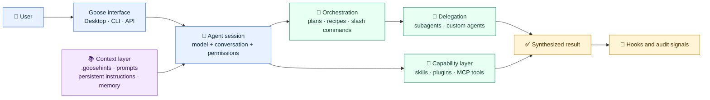
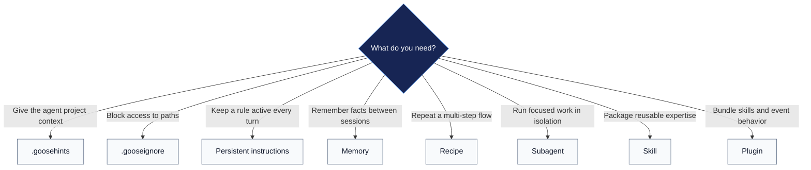

<div align="center">

# 🪿 Goose Mesh

### Practical patterns for context-aware, tool-using, multi-agent systems with Goose

[](https://github.com/aaif-goose/goose)
[](https://modelcontextprotocol.io/)
[](https://sli.dev/)
[](https://www.python.org/)

**[Explore the examples](#-example-catalog) · [Understand the architecture](#-architecture) · [Run locally](#-quick-start)**

</div>

---

## Why this repository exists

Goose Mesh is a practical reference for building reliable agentic systems with [Goose](https://github.com/aaif-goose/goose), the open-source AI agent governed by the Agentic AI Foundation under the Linux Foundation. It pairs a visual technical narrative with small, runnable examples that show how an agent receives context, chooses tools, delegates work, preserves useful knowledge, and stays inside project guardrails.

The repository is designed for three kinds of use:

- **Learn:** see each context-engineering capability in isolation.
- **Adopt:** copy a focused example into an existing repository.
- **Extend:** combine hints, skills, recipes, subagents, hooks, and plugins into a larger agent system.

> [!IMPORTANT]
> This repository contains integration patterns and reference implementations; it does not contain the Goose runtime itself. Use the official [Goose repository](https://github.com/aaif-goose/goose) and [documentation](https://goose-docs.ai/) for installation, provider configuration, and the latest runtime behavior.

## ✨ What is included

| Layer | Capability | What you can inspect |
| --- | --- | --- |
| Context | Project instructions, ignore rules, prompt overrides | How an agent receives the right information without flooding its context window |
| Memory | Persistent instructions and cross-session memory | The difference between always-on guardrails and selectively recalled facts |
| Orchestration | Planning, recipes, subrecipes, slash commands | Repeatable flows with explicit inputs, review points, and bounded execution |
| Delegation | Subagents and custom agents | Isolated specialist contexts, parallel work, and result synthesis |
| Extension | Skills, plugins, hooks, MCP-compatible tools | Reusable capability packages, event handling, and external tool access |
| Verification | Python checks, unit tests, and Make targets | Deterministic validation before an agent-driven example is run |

## 🏗️ Architecture

Goose is best understood as an **agent runtime and extensibility platform**. A session combines a model with contextual instructions and tools; orchestration features can then split larger objectives into isolated tasks and merge their results.



### Control and data flow

1. The interface starts a session with a configured model and permission mode.
2. Context sources contribute project rules, relevant files, prompt behavior, and remembered facts.
3. The main agent reasons over the request and selects a direct tool, reusable skill, or orchestration flow.
4. Recipes and subagents create bounded execution paths; isolated contexts keep specialist work focused.
5. Results return to the main session for synthesis, while hooks can enforce policy or record safe operational signals.

### Context strategy

| Need | Mechanism | Lifetime | Typical use |
| --- | --- | --- | --- |
| Repository conventions | `.goosehints` | Loaded with project context | Architecture rules, commands, coding conventions |
| Protect paths | `.gooseignore` | Project or global configuration | Secrets, generated files, private directories |
| Keep a rule visible | Persistent instructions | Every turn | Safety constraints and non-negotiable checks |
| Recall useful knowledge | Memory extension | Across sessions | Commands, preferences, stable project facts |
| Change core behavior | Prompt templates | New sessions | System, planning, and compaction behavior |
| Package expertise | Agent Skills | Loaded when relevant | Repeatable procedures with scripts and references |

## 🧩 Example catalog

Every directory below is self-contained, documented, and paired with a `Makefile`. Run `make` in a directory to see its supported targets.

| Example | Focus | Start here |
| --- | --- | --- |
| **Goose hints** | Root and nested `.goosehints`, immediate `@file` context, validation | [Guide](context-engineering/goosehints/README.md) |
| **Ignore rules** | Project and global access controls using `.gitignore`-style patterns | [Guide](context-engineering/gooseignore/README.md) |
| **Persistent instructions** | Always-visible guardrails through the Top of Mind extension | [Guide](context-engineering/persistent-instructions/README.md) |
| **Memory** | Local facts saved and recalled across sessions | [Guide](context-engineering/memory-extension/README.md) |
| **Prompt templates** | Custom system, planning, and compaction prompts | [Guide](context-engineering/prompt-templates/README.md) |
| **Planning mode** | Reviewable plan-then-execute behavior and optional planner model | [Guide](context-engineering/planning-mode/README.md) |
| **Recipes** | Parameterized workflows and isolated subrecipes | [Guide](context-engineering/recipes/README.md) |
| **Subagents** | Parallel specialist reviews followed by sequential synthesis | [Guide](context-engineering/subagents/README.md) |
| **Slash commands** | Project commands backed by reusable recipes | [Guide](context-engineering/slash-commands/README.md) |
| **Custom agents** | Project-scoped specialists, delegation, and lifecycle tooling | [Guide](context-engineering/custom-agents/README.md) |
| **Agent Skills** | A complete release-readiness skill with workflows, scripts, policy, and tests | [Guide](context-engineering/agent-skills/README.md) |
| **Plugins** | A packaged skill plus policy and event hooks | [Guide](context-engineering/plugins/README.md) |
| **Hooks** | Session and tool event handlers with privacy-conscious logging | [Guide](context-engineering/hooks/README.md) |

## 🧭 Choosing the right mechanism



The mechanisms are complementary. A production repository might use `.goosehints` for conventions, `.gooseignore` for boundaries, a skill for release checks, and a recipe that delegates independent analysis to subagents.

## 🛠️ Technology stack

### Runtime and automation

| Technology | Role in this repository |
| --- | --- |
| [Goose](https://github.com/aaif-goose/goose) | Agent runtime used to exercise the examples |
| [Model Context Protocol](https://modelcontextprotocol.io/) | Standard boundary between agents and external tools or services |
| Python 3.11+ | Dependency-light validators, lifecycle helpers, hook handlers, and unit tests |
| GNU Make | Consistent `test`, `validate`, `verify`, `demo`, and `run` entry points |
| YAML and JSON | Recipes, configuration examples, plugin manifests, hooks, and policy files |
| Markdown | Hints, prompts, agent definitions, skills, workflows, and documentation |

Most Python examples deliberately use the standard library only. This keeps validation fast, auditable, and easy to run before connecting an LLM provider.

### Visual documentation

| Library | Purpose |
| --- | --- |
| [Slidev](https://sli.dev/) | Markdown-first technical presentation and static build |
| [Vue 3](https://vuejs.org/) | Custom interactive components |
| `@slidev/theme-default` and `@slidev/theme-seriph` | Presentation themes |
| [Playwright Chromium](https://playwright.dev/) | Browser engine used for PDF, PPTX, and PNG export |
| Custom CSS | Accessible type, color, layout, and presentation chrome defined in [`styles/index.css`](styles/index.css) |

See [`DESIGN.md`](DESIGN.md) for the visual system, layout constraints, accessibility choices, and export notes.

## 🚀 Quick start

### Prerequisites

- Node.js and npm for the visual documentation
- Python 3.11 or newer for all local validators and tests
- GNU Make for the short commands shown in the example guides
- Goose CLI or Goose Desktop with a configured model provider for interactive runs

### Build the visual documentation

```bash
git clone https://github.com/khshaik/agentic-systems.git
cd agentic-systems/goose-mesh
npm install
npm run dev
```

The development server provides live preview. Other available commands are:

```bash
npm run build         # build the static site
npm run export        # export PDF
npm run export:pptx   # export image-based PowerPoint
npm run export:png    # export slide images
```

### Run a deterministic example

The local checks do not require a model provider:

```bash
cd context-engineering/goosehints
make test
```

For the complete Agent Skill example:

```bash
cd ../agent-skills
make verify
```

Interactive targets such as `make run` require a configured Goose installation. Read the example's guide first because permission modes, extensions, and configuration differ by capability.

## 📁 Repository map

```text
goose-mesh/
├── README.md                    # Project overview and navigation
├── DESIGN.md                    # Visual language and layout decisions
├── slides.md                    # Slidev source
├── components/                  # Reusable Vue components
├── styles/                      # Presentation CSS and design tokens
├── global-bottom.vue            # Shared progress and slide-number chrome
├── export/                      # Generated presentation artifacts
├── images/                      # Optional local image assets
└── context-engineering/
    ├── goosehints/              # Hierarchical project context
    ├── gooseignore/             # File access boundaries
    ├── persistent-instructions/ # Always-on working-memory rules
    ├── memory-extension/        # Cross-session recall
    ├── prompt-templates/        # Prompt overrides
    ├── planning-mode/           # Plan review before execution
    ├── recipes/                 # Reusable flows and subrecipes
    ├── subagents/               # Isolated parallel delegation
    ├── slash-commands/          # Recipe-backed commands
    ├── custom-agents/           # Project specialist definitions
    ├── agent-skills/            # Portable expertise package
    ├── plugins/                 # Skill and hook bundle
    └── hooks/                   # Event-driven automation
```

## ✅ Reliability and safety principles

- **Validate locally first.** Structural checks and unit tests catch configuration errors without spending model tokens.
- **Keep context intentional.** Prefer concise instructions and load large references only when needed.
- **Separate independent work.** Parallelize read-only analysis; serialize tasks that share files or depend on earlier output.
- **Treat permissions as architecture.** Use ignore rules, focused tool access, and explicit approval modes as layered controls.
- **Do not store secrets in memory or prompts.** Use a proper secret manager and keep sensitive paths outside agent access.
- **Audit extensions before installation.** Skills, hooks, and plugins may execute local code with the user's permissions.
- **Pin and verify for production use.** Goose evolves quickly; confirm behavior against current official documentation before adopting an experimental capability.

## 🌐 Where Goose fits

| Project | Primary mental model | Strongest fit |
| --- | --- | --- |
| **Goose** | Extensible agent runtime with tools, skills, recipes, and subagents | Local developer workflows and open, tool-rich agent systems |
| **CrewAI** | Teams of role-oriented agents | Collaboration modeled explicitly as an agent crew |
| **LangGraph** | Stateful graph of nodes and transitions | Fine-grained workflow control, persistence, and branching |

These categories overlap. Choose based on the control surface your system needs: runtime extensibility, team composition, or explicit state-machine semantics.

## 📚 Further reading

- [Goose documentation](https://goose-docs.ai/)
- [Goose source code](https://github.com/aaif-goose/goose)
- [Model Context Protocol](https://modelcontextprotocol.io/)
- [Agentic AI Foundation](https://aaif.io/)
- [Slidev documentation](https://sli.dev/)

---

<div align="center">

**Start small: add the right context, grant the minimum tools, verify the behavior, then compose.**

</div>
